# KVMem + llama.cpp

## Near-lossless Qwen3.8-27B at a full 256K workspace on 16 GiB VRAM

llama.cpp inference with tiered KV memory for long-running agents.

**KVMem** adds a bounded GPU KV working set, host-memory storage and query-based retrieval to [llama.cpp](https://github.com/ggml-org/llama.cpp). llama.cpp handles model loading, inference, quantization and MTP. The separate `llama-kvmem-server` provides OpenAI-compatible chat, tools and optional vision. **NVMe offload is not implemented.**

This port supports **Qwen3.8-27B GGUF quants**, including IQ3 and IQ4. The sibling [kvmem-qw3](https://github.com/kvmem/kvmem-qw3) is a CUDA-native runtime focused on Q8, primarily tested on RTX PRO 6000.

The logical workspace (`-c`) can extend beyond 256K using host RAM; quality at those lengths remains experimental.

The [KVMem paper](https://arxiv.org/abs/2609.04852) shows that, on queries up to 256K, keeping only a **32K GPU-resident active context** is essentially lossless versus the **full 256K** history: **LongMemEval-S** 85.6% vs 86.6% accuracy, **AgentLongBench** 60.9% vs 59.5% task success.

**KV streaming vs. KVMem.** Both methods support a full 256K context on a 16 GiB GPU by storing part of the KV cache in host RAM. [Raymond Huang’s adaptive KV-cache streaming](https://medium.com/@raymond860909/running-qwen-27b-on-16g-vram-with-full-context-length-building-adaptive-kv-cache-streaming-for-bf1e819116e9) keeps part of the KV cache in VRAM and stores the rest in host RAM. During decoding, it prefetches the offloaded KV layer by layer through reusable GPU buffers, overlapping transfers with computation. This preserves attention over the entire history, but longer contexts increase both attention work and PCIe traffic, eventually slowing decode.

KVMem retrieves relevant historical blocks into a bounded GPU window, limiting the KV used for attention. On RTX 5060 Ti, the current MTP3 256K tool benchmark achieves **32–33 token/s decode**, **437–463 token/s prefill for initial computation** and **242–253 token/s overall prefill**, including input reprocessing and cache management.

**Performance on faster GPUs.** Our measurements use the RTX 5060 Ti, the entry-level 16 GB option in the desktop RTX 50 series. The 16 GB RTX 5070 Ti and RTX 5080 offer substantially more compute and roughly twice the memory bandwidth ([NVIDIA specifications](https://www.nvidia.com/en-us/geforce/graphics-cards/compare/)). We therefore expect substantially faster GPU prefill and decode on these cards. Actual gains depend on the workload, CPU and host-memory transfers; benchmarks on these GPUs are welcome.

Current milestone: [`v0.16.0-rc1`](docs/milestones/v0.16.0-rc1.md) (pre-release).

**Limitation:** one generation cannot exceed `--kvmem-gen-reserve` (16384 tokens on the IQ3 recipe, 12288 on IQ4), including thinking. Retrieval pins the GPU window; new tokens only use those reserved slots. We are working on fixing this. For agent use, add a line to the system prompt such as: *Keep each turn's output, including thinking, within 16384 tokens* (use 12288 on IQ4). That makes oversized single-turn replies much less likely.

## How KVMem works

Completed KV blocks are stored in host RAM. For each agent step, KVMem retrieves relevant blocks using the current query and places them in chronological order in a bounded GPU working set. Previously computed KV is reused across turns.



Core flags (what the 16 GiB recipes still pass):

| Flag | Meaning |
|---|---|
| `-c` | Logical workspace, including history stored off GPU. 256K is the tested default; larger is experimental. |
| `--kvmem-budget` | How many historical tokens retrieval may keep on GPU. |
| `--kvmem-gen-reserve` | GPU slots reserved for new tokens so retrieval cannot fill the pool. **One generation cannot exceed this length** (including thinking). |
| `--kv-dtype` | Quantization of the **main** attention KV (IQ3 q8_0, IQ4 q5_0). |
| `--spec-type draft-mtp` | Enable multi-token prediction. |
| `--mmproj` | Vision projector GGUF. Omit for text-only. |

KVMem retrieval is on by default, with 128-token blocks, query replay `auto`, query policy `user`, MTP draft length 3, F16 draft KV, and ReplaySSM. You do not need to pass those unless you are overriding them. GPU KV size is `budget + gen_reserve`. When history exceeds `--kvmem-budget`, retrieval picks blocks for the current last-user query. Clients should send the full `messages` history each turn.

## How KVMem attaches to llama.cpp

`kvmem/` holds the host store and retrieval logic; `src/adapter/` connects it through llama.cpp’s memory interface. Attention kernels and original positions stay unchanged. Reselection transfers only blocks that changed.

Do **not** commit a dirty `llama.cpp` working tree. The submodule pointer is the pin; `scripts/apply-patches.sh` replays `patches/`.

## Tested platform

- Ubuntu 22.04.5 on WSL2, x86-64.
- RTX 5060 Ti with 16 GiB VRAM; Intel Core Ultra 7 255H and 32 GiB RAM (19.53 GiB visible to WSL2).
- CMake 4.4.3 and CUDA 13.2.86.

The project builds on llama.cpp's CUDA backend, with the platform above used for our measurements. Reports of successful runs, benchmarks and issues on other NVIDIA GPUs and systems are welcome. AMD/ROCm and Metal backends would need integration work.

## Clone, patch, build

Building uses a C++17 compiler, CMake and the CUDA toolkit. The startup scripts use Python 3.10+ and `ss` (iproute2).

```bash
git clone --recurse-submodules https://github.com/kvmem/kvmem-llama.cpp.git
cd kvmem-llama.cpp
git checkout v0.16.0-rc1
git submodule update --init
scripts/apply-patches.sh
scripts/build-cuda.sh
```

The submodule is ggml-org/llama.cpp at pin `b81c99b`. `scripts/apply-patches.sh` applies `patches/llama-kvmem-current.patch` (or `multimodal-upgrade.patch` on an older KVMem tree). Running it twice is safe. Do **not** apply numbered `0001`–`0004` together with the cumulative patch. See [patches/README.md](patches/README.md).

`scripts/build-cuda.sh` sets `GGML_CUDA_FA_ALL_QUANTS=ON` (needed for `--kv-dtype q5_0` on hybrid models). Binaries: `build/bin/llama-kvmem-server`.

The build script defaults to `CMAKE_CUDA_ARCHITECTURES=120a-real` for the tested RTX 5060 Ti. For another GPU, set `CMAKE_CUDA_ARCHITECTURES` to its appropriate target when running the script; other GPU targets have not been tested here.

## Recommended settings (16 GiB)

Both recipes use a 256K workspace and a bounded GPU KV working set. The listings below match `scripts/start-iq3.sh` / `start-iq4.sh`: they only pass flags that are not already server defaults. Sampling follows the Qwen3.8-27B card and can be overridden per request; `temperature=0` is greedy.

| | Thinking (these recipes) | Non-thinking |
|---|---:|---:|
| temperature | 1.0 | 0.7 |
| top_p | 0.95 | 0.80 |
| top_k | 20 | 20 |
| min_p | 0.0 | 0.0 |
| presence_penalty | 0.0 | 1.5 |
| frequency_penalty | 0.0 | 0.0 |
| repetition_penalty | 1.0 | 1.0 |

```bash
# Choose one recipe; both default to port 18200.
scripts/start-iq3.sh    # text + GPU vision + MTP, :18200
scripts/start-iq4.sh    # text + CPU vision + MTP, :18200

# Switch an existing KVMem service to IQ4.
scripts/start-iq4.sh --restart

# Override GPU and model, or preview the resolved configuration.
CUDA_VISIBLE_DEVICES=0 MODEL=/path/model.gguf scripts/start-iq4.sh
scripts/start-iq4.sh --dry-run
```

GPU selection honors `CUDA_VISIBLE_DEVICES`; otherwise it chooses a 5060 Ti or the only GPU. Ambiguous multi-GPU setups require an explicit selection. `MODEL`, `MMPROJ`, `MMPROJ_DEVICE` and `PORT` can override recipe defaults. MTP3 and ReplaySSM are server defaults; override with `SPEC_DRAFT_N_MAX` and `KVMEM_MTP_STATE` if needed. CUDA libraries come from the build directory, caller environment or the toolkit recorded during compilation; use `CUDA_HOME` or `LD_LIBRARY_PATH` for a custom installation. An existing matching service is reused; switching configuration requires `--restart`, which only stops this project's server.

### Thinking and chat templates

The launchers accept optional template settings, using llama.cpp's native Jinja renderer:

```bash
scripts/start-iq3.sh --reasoning-effort low
scripts/start-iq4.sh --chat-template-file /path/custom.jinja \
  --chat-template-kwargs '{"enable_thinking":true}'
```

Add `--restart` to change an existing service. Inline Jinja is accepted through `--chat-template`; Jinja is always enabled (`--jinja` is also accepted).

Requests to `/v1/chat/completions` can override the defaults:

```json
{
  "messages": [{"role": "user", "content": "What is 19 × 23?"}],
  "reasoning_effort": "low",
  "chat_template_kwargs": {"enable_thinking": true},
  "reasoning_budget_tokens": 128,
  "max_tokens": 512
}
```

In the current GSQ 27B template, `low` and `xhigh` inject instructions for brief or careful reasoning; `medium` adds neither instruction. The template defaults to `xhigh`. These are prompt preferences: `reasoning_budget_tokens` controls the thinking budget, while `max_tokens` limits the whole output. Other models may support different effort levels.

`reasoning_effort: "none"` disables thinking; `"default"` removes the effort override and uses the template's default. A positive effort does not turn thinking back on if it is disabled. Request kwargs override launcher defaults, and top-level `reasoning_effort` overrides the value in kwargs. For `enable_thinking`, kwargs take precedence over the top-level field; use JSON booleans, not strings. Template changes reuse the common rendered prefix where possible; changing instructions near the start of the history can require processing that history again.

### IQ3 27B — text + vision, with MTP

`scripts/start-iq3.sh`. ISTA GGUF **as published** (MTP head not requantized). **Main KV q8_0**, MTP KV F16.

- Text: [ISTA-DASLab/Qwen3.8-27B-GSQ-RCO-GGUF](https://huggingface.co/ISTA-DASLab/Qwen3.8-27B-GSQ-RCO-GGUF) → `Qwen3.8-27B-GSQ-RCO-IQ3_S-mtp.gguf` (use the `-mtp` file)
- Vision: [unsloth/Qwen3.8-27B-GGUF](https://www.modelscope.cn/models/unsloth/Qwen3.8-27B-GGUF) `mmproj-BF16.gguf`, locally quantized to `mmproj-Q8_0.gguf` (`llama-quantize`; most weights Q8_0, 27 `ffn_down` tensors stay F16)

After downloading the BF16 projector, run from the repository root:

```bash
model_dir=models/unsloth/Qwen3.8-27B-GGUF
build/bin/llama-quantize --max-buffer-size 256 \
  "$model_dir/mmproj-BF16.gguf" "$model_dir/mmproj-Q8_0.gguf" Q8_0
```

The quantizer automatically falls back to F16 for the 27 incompatible `ffn_down` tensors.

```text
-m Qwen3.8-27B-GSQ-RCO-IQ3_S-mtp.gguf
--mmproj mmproj-Q8_0.gguf --mmproj-offload --image-max-tokens 512
-c 262144 -n 16384
--kvmem-budget 36864 --kvmem-gen-reserve 16384
--kv-dtype q8_0
--spec-type draft-mtp
--enable-thinking --reasoning-budget 4096
```

If GPU vision does not fit, `MMPROJ_DEVICE=cpu`.

### IQ4 27B — text + vision on CPU, with MTP

`scripts/start-iq4.sh`. Projector is **on CPU** by default (`--no-mmproj-offload`) so 16 GiB VRAM stays for the language model. Override with `MMPROJ_DEVICE=gpu` if you have spare VRAM.

Download Unsloth `Qwen3.8-27B-UD-IQ4_XS.gguf` and `mmproj-BF16.gguf` ([ModelScope](https://www.modelscope.cn/models/unsloth/Qwen3.8-27B-GGUF) / [Hugging Face](https://huggingface.co/unsloth/Qwen3.8-27B-GGUF)). Upstream MTP head is Q6_K / Q8_0.

The language GGUF this recipe runs, `Qwen3.8-27B-UD-IQ4_XS-mtp-q4_0.gguf`, is **not** an Unsloth release: only MTP (`blk.64`) matmul weights were requantized to **Q4_0**. Vision uses the official **BF16** `mmproj-BF16.gguf` on CPU.

Download [imatrix_unsloth.gguf](https://huggingface.co/unsloth/Qwen3.8-27B-GGUF/blob/main/imatrix_unsloth.gguf) into the same model directory, then run from the repository root:

```bash
model_dir=models/unsloth/Qwen3.8-27B-GGUF
build/bin/llama-quantize --allow-requantize --max-buffer-size 256 \
  --imatrix "$model_dir/imatrix_unsloth.gguf" \
  --tensor-type-file scripts/quantization/qwen3.8-27b-iq4-xs-mtp-q4_0.types \
  "$model_dir/Qwen3.8-27B-UD-IQ4_XS.gguf" \
  "$model_dir/Qwen3.8-27B-UD-IQ4_XS-mtp-q4_0.gguf" IQ4_XS
```

The supplied [tensor map](scripts/quantization/qwen3.8-27b-iq4-xs-mtp-q4_0.types) preserves the original model's mixed quantization and changes only eight MTP matrices. The current quantizer requires the imatrix file to accept the existing low-bit tensors.

```text
-m Qwen3.8-27B-UD-IQ4_XS-mtp-q4_0.gguf
--mmproj mmproj-BF16.gguf --no-mmproj-offload --image-max-tokens 512
-c 262144 -n 12288
--kvmem-budget 32768 --kvmem-gen-reserve 12288
--kv-dtype q5_0
--spec-type draft-mtp
--enable-thinking --reasoning-budget 4096
```

### 5060 Ti results

**Test hardware:** RTX 5060 Ti 16 GiB, Intel Core Ultra 7 255H, 32 GiB RAM. Ubuntu 22.04.5 on WSL2 exposes 16 logical CPUs and 19.53 GiB RAM.

Both tasks use MTP3 with ReplaySSM and thinking with a 128-token budget and at most 512 output tokens per request. That is the speed-test setting; the start scripts default to `--reasoning-budget 4096`. IQ3 uses GPU Q8_0 vision; IQ4 uses CPU BF16 vision. RAM is runtime process RSS, excluding loading; VRAM is whole-GPU usage.

Task 1: ~12K text, then one image, then code generation. One warmup run precedes two measured runs. This test uses `--image-max-tokens 1024`; measured repeats reuse cached image embeddings. The recipes retain a 512-token image limit.

| Metric | IQ3 | IQ4 |
|---|---:|---:|
| Prefill — initial computation | 574.49 token/s | 595.60 token/s |
| Prefill — overall | 544.65 token/s | 505.52 token/s |
| First image encode (warmup) | **0.41 s** | **21.79 s** |
| Aggregate decode | **38.55 token/s** | **44.30 token/s** |
| Image decode | 38.64 token/s | 45.83 token/s |
| Code decode (512 tokens) | 39.88 token/s | 44.35 token/s |
| MTP acceptance | 70.74% | 80.85% |
| Runtime host RAM peak | **4308.21 MiB** | **4846.82 MiB** |
| VRAM peak | **15591.10 MiB** | **15445.10 MiB** |
| Minimum free VRAM | 460.90 MiB | 606.90 MiB |

Task 2: 32 tool-result rounds plus a base request, reaching **262058 / 262144 tokens** including generation. Both recipes receive identical requests; projectors stay loaded, but no images are sent.

| Metric | IQ3 | IQ4 |
|---|---:|---:|
| Prefill — initial computation | 437.13 token/s | 463.18 token/s |
| Prefill — overall | 242.06 token/s | 253.41 token/s |
| Aggregate tool-round decode | 31.74 token/s | 33.31 token/s |
| Code decode (512 tokens) | 30.53 token/s | 38.15 token/s |
| MTP acceptance | 64.70% | 67.08% |
| Runtime host RAM peak | **13483.52 MiB** | **11244.75 MiB** |
| VRAM peak | **15617.10 MiB** | **15591.69 MiB** |
| Minimum free VRAM | 434.90 MiB | 460.31 MiB |

Initial computation measures the first processing of new input. Overall includes any repeated processing, cache management and image encoding. Both rates use **total new input divided by the corresponding total time across the task**, counting visual rows as input positions. Decode includes thinking tokens. Code decode refers to the final request.

[Full results and benchmark commands](docs/recommended-config-performance.md). Summarize saved logs with `python3 scripts/summarize_canary.py <artifact-directory>`.

### Which one to run

| | IQ3 | IQ4 |
|---|---|---|
| Images | GPU vision | CPU vision |
| Decode (Task 1 / Task 2) | ~39 / ~32 token/s | ~44 / ~33 token/s |
| GPU KV window | 36K retrieve / 16K generate | 32K / 12K |
| Main KV | q8_0 | q5_0 |
| MTP weights | Official ISTA `-mtp` | Local Q4_0 requant of Unsloth |
| Runtime host RAM (Task 1 / Task 2) | 4308.21 / 13483.52 MiB RSS | 4846.82 / 11244.75 MiB RSS |

**Default: IQ3** for fast image encoding and a larger KV window. **IQ4** suits mostly text workloads, with faster decode and lower RAM use in the long-context test, if CPU image encoding is acceptable.

## APIs

- `GET /health`
- `GET /v1/models`
- `POST /v1/chat/completions` (sampling, stream, tools, optional images)

No auth or TLS. Bind `127.0.0.1`. Stream `usage` includes `prompt_cache_hit_tokens` / `prompt_cache_miss_tokens`.

## Documentation

- [v0.16.0-rc1 milestone](docs/milestones/v0.16.0-rc1.md)
- [Modification plan](docs/modification-plan.md)
- [Architecture](docs/architecture.md)
- [Patch replay](patches/README.md)
- [Recommended 16 GiB performance](docs/recommended-config-performance.md)
- [256K tool benchmark](docs/long-context-benchmark-2026-09-14.md)
- [Query replay](docs/query-replay-implementation-report-2026-09-14.md)
- [Multimodal usage](docs/multimodal-implementation-report-2026-09-14.md)
- Native Qwen engine: [kvmem/kvmem-qw3](https://github.com/kvmem/kvmem-qw3)

## Project layout

```
kvmem/            Host KVMem library (no llama.cpp includes)
src/adapter/      llama_memory_i wrapper
tools/            llama-kvmem-cli, llama-kvmem-server, vision helpers
scripts/          apply-patches, CUDA build, GPU bind, start helpers
patches/          Diffs against the llama.cpp pin
docs/             Architecture, milestones, multimodal
llama.cpp/        Submodule (pin only; apply patches after clone)
models/           Local GGUFs (gitignored)
```

## Acknowledgments

Thanks to **melis** and **redsnow23** from Bilibili for testing the project and providing helpful feedback.

## License

Checkpoints are distributed separately and may use different terms. llama.cpp remains under its upstream license. KVMem-qw3 source is Apache-2.0; this port should be treated the same unless a `LICENSE` file is added to this tree.

## Paper and citation

[KVMem: Virtualizing Million-Token Agent Workspaces on a Consumer GPU](https://arxiv.org/abs/2609.04852)

Copy the BibTeX entry below and cite it with `\cite{chai2026kvmem}`.

```bibtex
@misc{chai2026kvmem,
  title         = {{KVMem}: Virtualizing Million-Token Agent Workspaces on a Consumer {GPU}},
  author        = {Di Chai and Leye Wang and Zeshen Su and Zhiguo Xia and Zhihang Yu},
  year          = {2026},
  eprint        = {2609.04852},
  archivePrefix = {arXiv},
  primaryClass  = {cs.LG},
  url           = {https://arxiv.org/abs/2609.04852}
}
```
