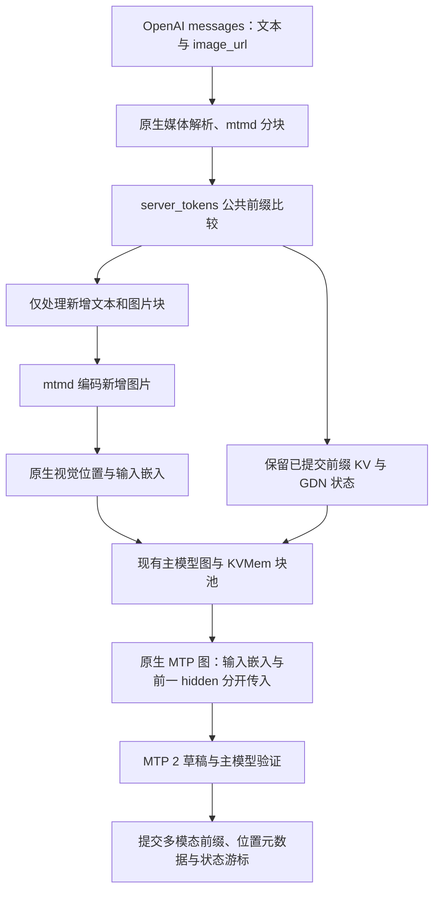

# 多模态接入分析与设计：保留前缀 KV 和 MTP

日期：2026-09-13。本文保留原始设计依据；2026-09-14 的实现、配置调整及验证证据见 [实现与验收报告](multimodal-implementation-report-2026-09-14.md)。

目标是在 IQ3 中加载 `models/unsloth/Qwen3.8-27B-GGUF/mmproj-Q8_0.gguf`，支持视觉头 GPU / CPU 两种放置方式，以及 OpenAI 格式的图片请求。追加图片不能触发主上下文重建或历史文本全量 prefill；图片后的文本生成应继续支持 MTP 2。

## 1. 结论

采用同一个主模型上下文、同一套 KVMem 块池和同一个 MTP 跟随上下文，增加原生多模态输入与位置元数据的适配。复用 llama.cpp 的图片处理、前缀比较、模型图、RoPE、attention mask、采样和缓存字节搬运，不另写视觉模型或 CUDA attention kernel。

之前考虑的“带图时换成原生上下文、清空后重新 prefill”方案不采用。仅加载视觉头、或跳过视觉 batch 后直接恢复 MTP，也不能满足目标。

这里的“不重新完整 prefill”有明确适用条件：同一驻留会话追加内容，公共前缀与已提交缓存一致。编辑历史、换模型/模板、进程重启或切换到无缓存的另一个会话，本来就可能需要重算；不能把失效的 KV 当作命中。本项目目前只有一个会话槽，本方案不会顺带承诺多会话缓存常驻。

## 2. 源码和模型事实

| 检查项 | 已确认事实 | 设计影响 |
|---|---|---|
| 模型元数据 | IQ3 架构 `qwen35`，embedding 5120；视觉头 `qwen3vl_merger`，projection 5120，名称均指向 Qwen3.8-27B | 维度初步匹配；仍须原生加载校验和真实看图验证，不能只凭维度保证兼容 |
| 文件大小 | 视觉头 629247552 bytes，即 600.10 MiB | 这不是显存峰值，还需编码计算空间 |
| 原生视觉库 | `mtmd_context_params` 提供 `use_gpu`、`device`、图像 token 限额；`mtmd_init_from_file` 校验投影维度 | 直接复用加载、设备选择、预处理和编码 |
| 原生前缀复用 | `server_tokens::get_common_prefix` 比较文本 token 与媒体 chunk ID；`pos_next` 区分 token 数和位置增量 | 不自行发明图片占位符比较算法 |
| 视觉位置 | M-RoPE 图片内多个 patch 的 `t` 相同，`x/y` 不同；图片位置增量是 `max(nx,ny)` | 缓存行数不能直接等于 RoPE 位置 |
| KVMem 槽定位 | `kvmem_fill_slot_info` 用 `ubatch.pos[i]` 定位逻辑块和唯一槽 | 原样传入图片会把多个 patch 定位到同一行，必须适配 |
| KV 恢复 | 当前生产路径保存 packed GPU K/V，`write_block_to_gpu` 直接复制已旋转/量化的字节 | 可恢复历史 KV，无须重跑历史 transformer；同时必须恢复位置元数据 |
| MTP 跟随 | `common_speculative_impl_draft_mtp::process` 遇到 embedding batch 直接返回，并有 vision TODO | 不能把“主模型看到了图片”当成“草稿也同步了图片” |
| MTP 模型图 | Qwen35 MTP 图有 `tok_embd` 和 `h` 两个输入；`llm_graph_input_embd_h::set_input` 目前以同一个 `ubatch.embd` 兼任两者 | 应分离视觉输入嵌入与上一位置 hidden state，复用现有模型图 |

源码入口：

- [`mtmd.h`](../llama.cpp/tools/mtmd/mtmd.h)、[`mtmd-helper.cpp`](../llama.cpp/tools/mtmd/mtmd-helper.cpp)：加载、编码、位置生成和分批解码。
- [`server-common.cpp`](../llama.cpp/tools/server/server-common.cpp)：`server_tokens`、媒体请求转换、图片 ID 与前缀比较。
- [`server-context.cpp`](../llama.cpp/tools/server/server-context.cpp)：原生服务按公共前缀推进多模态请求的调用方式。
- [`llama-kvmem-batch.cpp`](../src/adapter/llama-kvmem-batch.cpp)、[`llama-memory-kvmem.cpp`](../src/adapter/llama-memory-kvmem.cpp)：槽映射、占用、换出换入与位置假设。
- [`speculative.cpp`](../llama.cpp/common/speculative.cpp)、[`qwen35.cpp`](../llama.cpp/src/models/qwen35.cpp)、[`llama-graph.cpp`](../llama.cpp/src/llama-graph.cpp)：MTP 跟随与输入填充。

注意：原生服务提示多模态不支持的 `cache_reuse` 指移动非前缀片段的优化，不代表不支持普通公共前缀命中。`server-context.cpp` 仍调用 `get_common_prefix`。

## 3. 复用边界与整体流程

HTTP 解析、token/chunk 表示优先直接编译复用 `server-common` 的相关组件。若整文件链接引入原生 server 的无关依赖，则做小范围组件拆分并由两边共享，不复制一份长期分叉的 parser 或 LCP 实现。此处需要在实现前验证构建依赖闭包。

图片解码、缩放、patch/merge、投影、M-RoPE 坐标与分批规则全部使用 `mtmd`。为把逻辑行编号和 MTP 跟随信息传到每个 decode batch，优先给原生 helper 增加很薄的 batch 分发回调；现有 post-decode 回调可承接 MTP 跟随，但不足以单独解决 decode 前的槽定位。不要复制整套 `mtmd_helper_decode_image_chunk`。

## 4. 三套编号必须分开

| 编号 | 含义 | 消费方 |
|---|---|---|
| `logical_id` | 每个文本 token 或视觉 patch 的唯一、递增缓存行编号 | KVMem 块号、预算、换出、前缀长度、回滚边界 |
| `model_pos` | llama.cpp/mtmd 生成的原始模型位置，含视觉 `t/y/x` 等分量 | 原生 RoPE、KV cell 扩展位置和 attention mask |
| `slot` | 当前 GPU 中存放该行的物理位置 | 原有 D2D、D2H、H2D 与 KV tensor |

例如忽略视觉边界标记，60000 个文本 token 后追加一个 24×24 patch 网格：图片占 576 个缓存行，但 RoPE 游标只推进 24。随后文本的 `logical_id` 与 `model_pos` 就不同了。不能让它们重新合并，也不能把图片 RoPE 位置改成 576 个连续位置来迎合旧缓存代码。

设计新增每块的位置元数据，至少包括逻辑行范围、媒体标识/类型、每行原生模型位置、native KV cell 所需扩展元数据。纯文本前缀使用压缩的线性映射；图片和图片之后的文本保存对应映射。位置元数据在 CPU 常驻，跟随块生命周期及版本管理。

实现边界建议：

1. 在请求 batch 旁携带独立的逻辑行映射，进入 `llama_batch_allocr` 分割/重排后仍可追溯原 batch 行号。优先显式传播可选映射，避免根据重复的 RoPE 值反查，也不占用 RoPE 的“未使用第四维”。
2. KVMem 的 `fill_slot_info`、store append/truncate、capture 计数和检索区间按逻辑行工作；原生图仍接收原来的视觉位置。
3. 原生 KV cell 的位置与二维扩展字段保持原生语义，让现有 attention mask 继续工作。不能只修 RoPE，却把图片块错误地改为纯文本的逐 token causal mask。
4. 必须逐项区分 `seq_pos_max`、`seq_rm` 的原生位置语义与 KVMem 的逻辑范围语义。给 KVMem 增加明确的逻辑游标/截断接口，server 不再把 `tokens.size()` 直接当作原生位置。
5. 局部换出按物理 cell 集合移除。不能再用某个 patch 的 `[t,t+1)` 调用原生 `seq_rm`，否则会误删所有共享该 `t` 的 patch。必要时给原生 KV cache 暴露小范围的按 cell 操作入口，内部仍复用现有 cell 管理。
6. batch、graph 复用判定包含输入类型和位置布局；不能复用文本 batch 的不兼容输入绑定。

这部分是主要适配成本，不能以“mtmd 已支持”略过。具体映射字段落在公开 batch 还是内部 ubatch，需要由最小原型验证；不改动 RoPE/attention 数学定义。

## 5. 增量 prefill 与状态一致性

请求到来后使用 `server_tokens` 构造带媒体 ID 的 prompt，计算公共前缀 `L`。相同占位符或相同 URL 不足以判定图片相同：复用原生图片内容哈希，并将 projector、预处理配置、图像尺寸/切片策略纳入缓存版本。运行中不热换 projector 或 CPU/GPU 编码配置，以免同一 cache key 对应不同嵌入。

正常追加路径：

1. 保留 `[0,L)` 的主模型 KV、块存储和 GDN 状态，不调用 `memory_clear_all`，不释放主上下文。
2. 处理现有文本生成路径可能尚未提交的尾 token，或从已保存状态恢复短尾部。明确记录是“已提交输入数”还是“已输出 token 数”。
3. 仅对 `[L,end)` 调用文本 decode 或图片编码/视觉 decode。已命中的历史图片不重新经过视觉 encoder，也不重新经过主模型。
4. 对需要检索的新问题，可以继续进行现有有限 query replay；这应单独计数，不能伪装成新 token，也不能扩大成历史前缀全量重算。
5. 成功后提交新的 prompt/chunk 元数据、主模型游标、GDN 检查点、MTP 游标与 carry 状态。

图片 chunk 是前缀比较和历史编辑回退的原子单位。客户端替换旧图片时，从该图片前的有效边界恢复，图片之后受其影响的状态必须重算，图片之前的有效前缀继续保留。

GDN 不是只保存 KV 就够了。检查点应关联 `(logical_cursor, model_cursor, cache_epoch)`，并与原生 recurrent 状态对应；原生状态内部位置的语义不强改为逻辑编号。保留现有生成起点检查点，并在媒体边界按需保存有上限的 CPU 检查点。不能每个 patch 都保存一份大型 GDN 状态。已有回滚窗口之外、且没有有效检查点的历史编辑，明确报告可恢复边界和重算范围，不承诺零重算。

错误或取消时，未提交的 suffix 不得进入前缀命中表。保护最后一个已提交边界，截断新增行并恢复相应状态；不能用整上下文清空作为多模态错误的常规恢复方式。

## 6. KV 换出、恢复与检索

复用 `RawKvStore` 当前 packed GPU K/V 保存和搬运路径。保存的是已经完成原生 RoPE/量化的 K/V，重新载入原逻辑位置时直接拷贝字节，不对视觉 K 使用现有单一 `pos0` 的 NeoX 重建路径，也不根据新的物理 slot 再旋转。

必须同时恢复位置和 cell 元数据；只恢复 K/V 字节仍会得到错误 mask。D2D 重新布局也遵循同一规则。混合了文本和图片行的 128-token 块需要逐段处理，不能假设一个块内位置恒为 `orig_pos_start + i`。

检索预算按实际缓存行数扣减。新问题中的图片及其边界标记先整体保留；历史图片按媒体组选择，避免随机只取几行 patch。若当前图片组与必须保留的文本超出预算，返回明确的容量错误或由用户调低原生图像 token 上限，不静默丢弃图片，也不重置历史。图片只有输入、没有文本问题时，使用明确的媒体组保留策略，不从空文本 query 假造检索分数。

语义检索质量需独立评估。现有 mean-K 排序能否有效召回旧图片尚未实测；首版可保守保留最近/明确引用的完整媒体组。图片块组选择是在现有块选择器上扩展约束，不另建向量检索系统。

## 7. 带图后的 MTP 继续工作

最终方案不把带图会话永久降级为普通 decode。图片编码阶段没有“预测图片 token”的必要，但图片输入对应的草稿 KV 必须按顺序计算，随后文本仍走 MTP 2。

现有 MTP 跟随关系是 `(h[p-1], x[p])`：`h` 是主模型上一行 hidden state，`x` 是当前位置的输入嵌入。文本行的 `x` 来自 token embedding；图片行的 `x` 应来自 mtmd 的投影输出。主模型处理新增图片时已经产出需要的 hidden rows，无须为 MTP 重新跑历史主模型。

拟做的小范围原生扩展：

1. 给 batch/ubatch 明确区分输入嵌入与 MTP hidden state；`llm_graph_input_embd_h::set_input` 分别填充已有 `embd`、`h` tensor。保留文本 token + hidden 的兼容路径。
2. `common_speculative_impl_draft_mtp::process` 接受视觉 batch，使用真实视觉嵌入和右移一行的主模型 hidden；跨 text→image、image→text 和 ubatch 边界沿用 `pending_h` 机制。
3. 草稿输入使用相同的原生视觉位置和逻辑行映射，继承 target 的块到 slot 映射；MTP KV 类型继续独立配置，保存自己的实际 packed K/V，不能从主 KV 复制内容来代替草稿计算。
4. `begin`、draft、verify、accept、restore 改为同时维护逻辑长度与模型位置；不再把 `prompt.size()` 直接写入 M-RoPE 坐标。
5. 与 GDN 检查点一起管理 MTP 的已提交游标、`pending_h` 等 driver 状态；只保存 draft KV、不保存跨 batch carry，同样不能保证恢复正确。

生成前的门槛是 target/draft 已覆盖相同的已提交输入行范围，MTP 无缺失视觉行，carry 对应正确的上一行。然后调用现有 draft/verify/accept 机制预测后续文本。

现有 Qwen MTP 图具备两个数学输入入口，为该扩展提供实现依据，但不等于已经验证了视觉 MTP 的质量或加速效果。必须先证明普通解码和 MTP 在 greedy 下输出一致，再测官方采样下的接受率、吞吐及分布检查。视觉内容可能改变草稿接受率，不能预先保证仍有文本测试同样的提速。

只有显式调试选项才允许暂时关闭 MTP，并在响应/日志中标识；不把自动悄悄降级当作本任务完成。

## 8. GPU / CPU 与显存

计划复用原生参数语义：`--mmproj PATH`、`--mmproj-offload` / `--no-mmproj-offload`，映射至 `mtmd_context_params.use_gpu`，GPU 设备遵循脚本已有 GPU 绑定。CPU 模式只改变视觉 encoder/projector 的放置，主语言模型与 KV 仍在 GPU。

IQ3 脚本默认选择提供的视觉头及 GPU，可用脚本环境项如 `MMPROJ_DEVICE=cpu` 映射到原生 CPU 参数。模型、采样、KV 类型和检索/生成预算沿用当前 IQ3 配置。图像 token 上限复用原生 `image_max_tokens`，先实测再确定默认，不凭文件大小断言一定能放下。

显存与主存成本分开核算：

- 600.10 MiB 是文件大小；GPU 权重、encoder 计算空间、解码计算空间与分配器保留需分别测量。
- KV 池固定时，图片占用已有预算行，不必另建第二套完整上下文。例如 1024 个视觉行、16 个 attention 层、K/V 每行 1024 维，Q8_0 约占池中 34 MiB 的行容量；这不是固定池之外额外分配 34 MiB。
- 按每行 5120 维 F32 计算，1024 行投影嵌入约 20 MiB。优先随 batch 使用和释放；如为后续局部 replay 缓存，则放在有容量上限的 CPU 缓存，避免持久占用 GPU。实现需以原生实际输出宽度为准。
- 每行四个 int32 位置，1024 行约 16 KiB，且不随层数重复保存。纯文本线性映射可压缩。
- MTP 只临时持有当前 batch 的输入与 hidden，不为整段历史另建一份 dense hidden-state 缓存。

缓存已被换出 GPU 不代表需要重新 prefill：先从 CPU/NVMe 恢复对应 packed K/V；这是数据搬运，必须与模型计算计数分开。

## 9. 实现顺序与验收门槛

本节是后续实现顺序，当前仅写设计。

| 阶段 | 工作 | 通过条件 |
|---|---|---|
| A | 原生库链接、模型兼容性、GPU/CPU 加载 | 两种模式均用实际图片成功编码，记录权重及峰值；不修改线上脚本 |
| B | 原生 `server_tokens` 与增量请求表示 | 同图追加文本命中；同占位符换图片不能命中；媒体边界截断正确 |
| C | 逻辑行、原生位置、cell 映射适配 | 常驻缓存条件下与原生 mtmd 输出/logits 对照一致；不改原生 mask 语义 |
| D | packed K/V 与位置元数据换出换入 | Q8/Q5/Q4/F16 实际字节与元数据恢复正确，包含混合块、多块图片和 D2D 重排 |
| E | 同一主上下文增量图片 prefill | 60K 文本追加图片只计算新增区间和已解释的短尾/query replay；旧前缀不重算 |
| F | MTP 输入与 driver 状态同步 | 文本→图→文本、分 batch、拒绝回滚、重复请求均正确；greedy 与普通 decode 对照一致 |
| G | IQ3 实机与脚本集成 | GPU/CPU 看图、图片后的 MTP 2、工具调用/流式、错误恢复通过后再更新默认脚本 |

核心回归场景：

1. 先 prefill 约 60K 文本，再追加图片和问题：主 context 不变，前缀命中保留，只编码新图。
2. 同一图片历史追加第二个问题：encoder 调用数为 0，旧图片和文本的主模型 prefill 行数为 0；允许已记录的短尾/query replay。
3. 替换历史中的一张图：保留图前有效前缀，从有效检查点重算受影响后缀，不误用旧图 KV。
4. 图片跨 128-token 块、跨 ubatch；两个图片同尺寸/不同内容；新图插入最后一个不满块。
5. 强制视觉块和混合块换出、恢复到不同 GPU slot，再对照 logits、位置元数据和输出。
6. MTP 2 中全接受、部分接受、全拒绝，检查逻辑行/模型位置/carry 同步，无草稿视觉缺口。
7. 图片读取或编码失败、客户端取消后，原来的已提交前缀仍可继续使用。
8. 全部纯文本路径做回归，确认原先缓存命中、采样参数、工具调用和 KV 类型支持没有退化。

日志至少新增：`prefix_hit_rows`、`new_text_rows`、`new_image_rows`、`replayed_rows` 及原因、`vision_encode_calls`、`logical_cursor`、`model_cursor`、`mtp_synced_rows`、`context_reset_reason`。记录 decode 调用覆盖的实际逻辑范围，验收时检查前缀范围没有被再次提交，而不是只看接口宣称的 cache hit。

性能分别报告 encoder 时间、新增 prefill 时间、query/尾部 replay 时间、decode tok/s、MTP 接受率、整卡采样峰值和新增 CPU 内存。旧文本请求的 KV 基准不能替代图片实测。

## 10. 仍需原型验证的事项

- `server-common` 的最小链接边界，以及 helper 回调和逻辑行传播的具体接口形态。
- Native KV cell 位置、二维扩展、GDN 状态位置与 KVMem 逻辑操作的完整转换，特别是重复 `t` 的局部换出/截断。
- `embd` 与 MTP hidden 分离后，图复用和 ubatch 切分是否完整传递两路数据；Qwen35 的视觉 MTP 实际接受率。
- GPU encoder 最大图像分辨率下的 workspace 峰值，以及 IQ3 现有预算下的空间是否足够。
- 历史图片的检索保留策略与质量；不以“能描述一张小图”代替长会话和稀疏缓存验收。

这些是进入实现前后的验证门槛，不以全量重 prefill、错误坐标或自动关 MTP 绕过。
