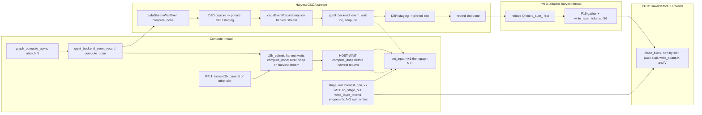

# Staged Prefill Optimization: llama.cpp + Out-of-Tree KVMem Harvest

| Field | Value |
|---|---|
| **Title** | Next staged optimization plan for KVMem prefill on llama.cpp |
| **Author** | KVMem llama.cpp adapter |
| **Date** | 2026-09-05 |
| **Status** | Landed / historical (rev 4: roadmap moved to `docs/retrieval-stagein-optimization.md`) |
| **Repo** | `/home/leye/kvmem_llamacpp` (v0.5.0). llama.cpp pin `b81c99b479d4c24e5eeca10de99032ebd343ef8f` |
| **Reference (read-only)** | `/home/leye/kvmem_qw3` |
| **Audience** | Engineers implementing Stage 0/1 without re-deriving the diagnosis |
| **Superseded as roadmap** | 2026-09-06: harvest thread + RAM mean-K landed; 128k `retr_ms` still ~229 s. **Next work is `docs/retrieval-stagein-optimization.md`.** Do not implement further harvest PRs from this file. |

Testing is paused. Do not relaunch `llama-kvmem-server`, do not refill 256k, do not restart qw3. Harvest Stage 1 in this file is landed; new work follows `docs/retrieval-stagein-optimization.md`.

---

## Overview

ISTA `Qwen3.8-27B-GSQ-RCO-IQ3_S-mtp.gguf` on the RTX 5090 completed a 260012-token retrieval+MTP prefill at **197 tok/s** (NVMe raw-K, `logs/ista_256k_fill.log`). Peak GPU **18122 MiB**. Graph: 4087 nodes, splits=2, ubatch 512, `CUDA0 compute buffer = 232.14 MiB`. That profile is host idle plus thousands of tiny ggml launches, not FlashAttention saturating HBM over a 60k window.

Operator notes from the paused session, **not in `logs/`** (do not treat as a merge gate): RAM-raw earlier ≈ **280 tok/s**; mid-prefill `nvidia-smi` **SM 24% / mem 5%**; host RSS with NVMe ≈ **2.07 GiB**. `logs/ista_256k_idle.txt` reports `rss_kb=11524340` (~11 GiB) after listen (model + pool). `ista_256k_rss.csv` `rss_kb` is mostly 0 / ~1.5k (collector looks wrong). Stage 0 T5 must write a UUID-filtered util csv and a working RSS sample so Stage 1 has an in-tree attribution baseline.

The KVMem-local bottleneck is harvest: `process_ubatch` launches the graph asynchronously, then `llama_kvmem_harvest_ubatch` host-syncs the capture backend, D2D-snapshots capture tensors with a **host** snap wait, converts F16→F32→F16, and issues ~256 synchronous 64 KiB `pwrite`s plus `drop_page_cache` on the compute thread. MTP uses blocking `ggml_backend_tensor_get` (PerThread copy; it does **not** wait for the ggml compute stream). qw3 overlaps D2H with the next chunk and coalesces NVMe on a worker.

This plan is five independently mergeable stages. Stage 0 proves the bubble. Stage 1 splits into: **(1.A) a safe fence** that still **host-waits `compute_done` before harvest returns** (so ubatch N+1 `set_input` cannot race graph N) while stream-ordering D2D/D2H; **(1.B) F16 store**; **(1.C) NVMe worker** (this is what can close the NVMe tax); **(1.D) MTP flush/size**. Do not touch `ggml_flash_attn_ext`. Stage 2 tries `-b 2048` / `-ub 2048`. Stage 3 optionally checks ggml CUDA graphs after harvest is gone. Stage 4 is an explicit non-goal: no FlashInfer / NVFP4 FFN / CuTe GDN port.

Hypothesis, not a guarantee: **PR 3 (worker + coalesced `write_spans`), not the graph fence, is what can close most of a RAM-vs-NVMe tax.** PR 1 must not claim a tok/s miracle. Nothing here turns a 4087-node ggml graph into qw3's fused ~1850 tok/s (1849.77 in `kvmem_qw3/docs/kvmem_fp8_performance_benchmark_20260725.md`).

---

## Background & Motivation

### Product state (v0.5.0)

KVMem is an out-of-tree `kvmem/` library plus a thin adapter in `src/adapter/`. llama.cpp remains the only inference engine. Patches live in `patches/` (factory, Q/K capture, hole-purge). Success is "llama.cpp can run KVMem." Speed never auto-fails tests. Retrieval miss is GO/NO-GO, not an automatic stop.

Hardware and build (must keep):

- RTX 5050, UUID `GPU-14f08a8c-8d62-4338-8ae4-c669889cdb29`, models **< 27B**.
- RTX 5090, UUID `GPU-58a7c28b-e698-307f-c149-24d4ecd88bf4`, **27B only**.
- `source scripts/gpu.sh small|27b`. CUDA: `/home/leye/kvmem_qw3/.cu13-env/bin/nvcc`, `CMAKE_CUDA_ARCHITECTURES=120a-real`, `scripts/build-cuda.sh`.
- Product default `--kvmem` = retrieval + query-last 64. `--no-think` on Qwen thinking models for needle tests.
- Daily Unsloth GGUFs from ModelScope; ISTA IQ3_S is a user-named exception.
- **ISTA IQ3_S: MTP stays off.** Do not pass `--spec-type draft-mtp` on IQ3
  recipes, T5, or 256k. Policy: `docs/architecture.md` (ISTA IQ3_S: MTP off).
  0.8B MTP canary is unchanged.

### Measured 256k baseline (cite; do not re-run)

Server flags (PID 143948, now stopped; 5090 VRAM 0; port 18181 free):

```text
-c 262144 -n 16 -b 512 -ngl 99 --kvmem --kvmem-budget 60000
--kvmem-gen-reserve 20000 --kvmem-block-tokens 32 --kvmem-method retrieval
--kvmem-query-last 64 --kvmem-gpu-ratio 0.85 --kvmem-nvme-gb 24
--kvmem-nvme-dir .../logs/kvmem_nvme --kvmem-raw-k-nvme
--spec-type draft-mtp --spec-draft-n-max 3
```

That 256k run **did** enable MTP. IQ3 MTP is now a closed experiment (no
decode gain; see architecture.md). **Do not repeat `--spec-type draft-mtp`
on IQ3_S.** Future IQ3 harvest/256k recipes are `--spec-type none` (CLI
default). The 197.5 tok/s / 18122 MiB numbers above still include MTP
follower harvest; compare like-for-like when remeasuring.

Server `-b` sets both `n_batch` and `n_ubatch`. CLI does **not** (see Stage 2).

| Item | Value | Source |
|---|---|---|
| Prefill tokens | 260012, HTTP 200, wall 1316.2 s ≈ **197.5 tok/s** | `logs/ista_256k_fill.log` |
| Peak GPU | **18122 MiB** of 24463 | `logs/ista_256k_vram.csv` |
| Graph | `graph nodes = 4087`, splits = 2, ubatch 512 | `logs/ista_256k_server.log:2367-2370` |
| Scratch | `CUDA0 compute buffer = 232.14 MiB`; `CUDA_Host = 98.14 MiB` | same |
| Slot pool | `KVMEM_KV_BYTES bytes=5242880000` (5 GiB), cells=80000, slots=2500 | `ista_256k_server.log:2347` |
| RS / MTP GPU | RS 598.50 MiB; MTP pool `bytes=327680000` (~312 MiB) | `ista_256k_server.log:2343,2374` |
| Model | `n_embd_k=1024`, 16 attn layers, 64 total (hybrid GDN) | `n_embd_k_gqa=1024` |
| Raw NVMe | `slot_bytes=65536`; `kvmem_raw_k.bin` **and** `kvmem_raw_mtp_k.bin` each `bytes=25769803776` (24 GiB) | `ista_256k_server.log:2345,2373` |
| Retrieval+MTP | `mtp_follow n_gpu=1875 n_writeback=1875 n_no_raw=0`; `query_replay begin=259948 n=63`; `spec_stats n_gen=16 n_drafted=21 n_accept=12 accept_pct=57.1` | `ista_256k_server.log:2381-2395` |
| `mtp_selected` dump | printed **unconditionally** (not gated on `trace_`) | `llama-memory-kvmem-mtp.cpp:528`; line `ista_256k_server.log:2380` |
| RAM-raw tok/s | ≈ 280 (operator note) | **not in `logs/`** |
| Mid-prefill util | SM 24% / mem 5% (operator note) | **not in `logs/`** |
| Host RSS (NVMe) | ≈ 2.07 GiB (operator note); idle listen `rss_kb=11524340` | **2.07 not in `logs/`**; idle in `ista_256k_idle.txt` |
| llama.cpp pin | `b81c99b479d4c24e5eeca10de99032ebd343ef8f` | submodule |
| CUDA graphs | `GGML_CUDA_GRAPHS=ON` in `build/CMakeCache.txt` (llama.cpp default) | this build |

qw3 order-of-magnitude only (different engine/quant/GPU class): Qwen3.6-27B Q8_0, chunk 2048, **1849.77 tok/s** in `kvmem_qw3/docs/kvmem_fp8_performance_benchmark_20260725.md`. Do not treat 1850 as a Stage 1 target.

### Diagnosis (verified in this tree)

Low GPU util is **not** "FA over 60k saturating HBM." 232 MiB compute scratch and (operator-note) 5% mem util disprove that. Ranked gaps versus qw3:

**1. Engine kernel shape (largest util gap; out of Stage 1).** 4087 ggml nodes versus FlashInfer + `nvfp4_ffn_prefill` + SM120 GDN. IQ3_S versus NVFP4/Q8 affects peak FLOP when busy, not harvest idle. `ggml_flash_attn_ext` stays untouched.

**2. Harvest serializes the compute thread every ubatch.**

`llama.cpp/src/llama-context.cpp` `process_ubatch` (after `graph_compute` → `ggml_backend_sched_graph_compute_async`):

```1410:1418:llama.cpp/src/llama-context.cpp
    const auto status = graph_compute(res->get_gf(), ubatch.n_tokens > 1);
    // ...
#if defined(LLAMA_KVMEM)
    llama_kvmem_harvest_ubatch(sched.get(), gtype == LLM_GRAPH_TYPE_DECODER_MTP);
#endif
```

`cparams.pipeline_parallel` is initialized **false** (`llama-context.cpp:285`). llama.cpp host-syncs before `set_inputs` only when `pipeline_parallel` is true. This 256k run logged `sched copies = 1`. On this laptop, **harvest’s `ggml_backend_synchronize` is the ubatch barrier**.

Next ubatch `set_input` uses `ggml_backend_tensor_set`. CUDA `ggml_backend_cuda_buffer_set_tensor` copies on **`cudaStreamPerThread`** and synchronizes **that** stream only (`ggml-cuda.cu:787-792`), not the compute stream. Deleting *all* host sync lets N+1 overwrite tokens/pos/mask while graph N still reads them. A snap wait on the compute stream orders **graph N+1 compute** after D2D; it does **not** order PerThread `set_input` after graph N.

`src/adapter/llama-memory-kvmem.cpp` `harvest_pending` / `d2h_submit` / `d2h_commit` today:

- `d2h_commit` of the **other** slot runs on the compute thread after graph N is launched: `cudaEventSynchronize(s.done)` then `harvest_from_host` (CPU pack + NVMe). That already overlaps pack of N−1 with graph N.
- `d2h_submit` then `ggml_backend_synchronize(be)` (or `cudaDeviceSynchronize`) after the full graph.
- D2D of capture tensors on `d2h_->stream`, then **`cudaEventSynchronize(d2h_->snap)`** (host wait).
- D2H async, later `cudaEventSynchronize(s.done)` on the next ubatch.
- `harvest_from_host` → `bytes_to_f32_token_major` (FP16→F32) → `RawKvStore::write_layer_tokens` packs F32→FP16 again.

Capture: `llama.cpp/src/llama-graph.cpp` `kvmem_capture_k` marks pre-RoPE K as `ggml_set_output` (no extra `cpy`). V is not captured on prefill (`kvmem_capture_v` is dump-only). Q is captured only on the query-last span, **in the same pinned buffer** as K (`d2h_submit` packs all `pending_capture_`).

The 2-slot `CaptureD2hPipe` is not a real overlap pipeline for NVMe: pack+`pwrite` of N still run on the compute thread at the start of harvest N+1 and can outlast graph N+1.

**3. NVMe writes are sync 64 KiB `pwrite` on the compute thread.**

`kvmem/src/host/raw_kv_store.cpp` `maybe_flush_k`: `capture_mean` then `nvme_->write_block` then `drop_page_cache` (inside `NvmeKvTier::write_slot_range`).

Per ubatch of 512 with 32-token blocks and 16 attn layers:

- Complete blocks flushed: `512/32 = 16` blocks × 16 layers = **256 × 64 KiB** sync writes.
- Bytes: 16 MiB K per ubatch. 260012/512 ≈ 508 ubatches → ~8.1 GiB K, **~130k pwrites** plus an equal number of `sync_file_range`/`posix_fadvise`.
- MTP adds 1 layer: ~1 MiB / 16 pwrites per ubatch, but the MTP file is still sized to the full `--kvmem-nvme-gb 24`.

qw3 (`src/qwen_executor.cpp`): `kvmem_try_direct_raw_k_d2h` async D2H into pinned writeback slots; `execution_wait_for_kv_transfer` is a **stream wait**, not a host sync; `kvmem_submit_raw_k_writeback_slot` uses `std::async` + `NvmeKvTier::write_spans` (coalesced `pwrite`). `effective_prefill_chunk_size` defaults to **2048**.

**4. `-b 512` versus qw3 default prefill chunk 2048.** More ubatches, skinnier GEMM/FA, 4× harvest frequency. qw3 docs (`kvmem_qw3/docs/kvmem_performance_evaluation_20260726.md`) warn that collapsing to 16/32-token chunks is a ~7× prefill cliff. This is Stage 2, not Stage 1.

**5. `GGML_CUDA_GRAPHS=ON` in this build** (`build/CMakeCache.txt`; llama.cpp default ON). Capture ends before `graph_compute` returns (`cudaStreamEndCapture` then `cudaGraphLaunch` on the compute stream), so a post-return event record is stream-ordered relative to that launch. Injecting `ggml_backend_event_wait` / `cudaStreamWaitEvent` on the compute stream **between** ubatches can still interact with the next `cudaStreamBeginCapture` (`cudaStreamCaptureModeRelaxed`). Harvest host-sync still cuts the timeline. `ggml_cuda_graph_check_compability` disables graphs when `MUL_MAT_ID` needs a stream sync; this 27B hybrid is not MoE. PR 1 must test graphs **ON and OFF**. Do not defer all graph interaction to optional Stage 3. Default ggml log will **not** print `CUDA graph warmup complete` (`GGML_LOG_DEBUG`).

**MTP is on the same critical path.** `tools/kvmem-spec.cpp` `kvmem_spec_decode_span` runs `llama_decode(target)` then `common_speculative_process` per ubatch:

1. target graph (4087 nodes) → trunk harvest (device sync today)
2. MTP draft graph → `llama_memory_kvmem_mtp::harvest_pending` → `ggml_backend_tensor_get` + `write_layer_tokens`

CUDA `get_tensor` copies on **`cudaStreamPerThread`** and syncs **that** stream — it does **not** wait for the ggml compute stream. Trunk harvest currently supplies the device sync; MTP does not. Overlap-rewriting trunk without fencing MTP both (a) leaves a blocking get+pwrite after every target ubatch and (b) can make MTP D2H racy once trunk no longer device-syncs.

`apply_retrieval` does `harvest_flush()` on the **trunk** pipe only, then `mtp_->harvest_resident_v()` / `follow_retrieval()`. There is no MTP `harvest_flush`. Fine while MTP harvest is synchronous; a miss once MTP has a pipe/worker. `follow_retrieval` requires `raw_->has_k` and prints `mtp_selected` **unconditionally**.

---

## Goals & Non-Goals

### Goals

- Overlap D2H with the next ubatch **without** breaking `set_input` or capture reuse, and **without** patching FlashAttention.
- Prove, with counters, whether a later stage moved the bubble (Stage 0 before any behavior change).
- Keep adapter isolation: llama headers only in `src/adapter/`. `kvmem/` stays llama-free.
- Keep the bounded GPU slot-pool with incremental reselect (reuse resident blocks; never pack `[0..W)`). Slot ≠ window RoPE pos. FA+mask over `n_kv ≈ budget`.
- Preserve v1 success rules: identity PASS; retrieval miss is GO/NO-GO; speed never auto-fails.
- Move NVMe `pwrite` off the compute thread with a specified worker + mutex so 256k still fits this laptop.
- Fence MTP in the **same merge** as the trunk fence. Shrink MTP NVMe to need by default.
- Keep tests on small Unsloth GGUFs (5050) plus short 27B IQ3_S prefills (5090). 256k is a milestone, not a per-PR gate, unless the user decides otherwise (see Open Questions).

### Non-Goals

- Do **not** patch `ggml_flash_attn_ext` or any `fattn*.cu`.
- Do **not** invent a new fused CUDA engine inside llama.cpp as Stage 1 (no FlashInfer, no NVFP4 FFN, no CuTe GDN port).
- Do **not** mix engine fusion into harvest IO PRs.
- Do **not** change the llama.cpp pin; no remote push.
- Do **not** restart qw3 or change the daily default off Unsloth.
- Do **not** delete all host sync of the compute stream. That is not equivalent to today’s barrier.
- Do **not** move `set_input` onto the compute stream (llama.cpp patch; non-goal).
- P6 Metal/Vulkan is out of scope.
- Continuous batching / multi-slot KVMem is out of scope.
- Chasing qw3-native ~1850 tok/s is out of v1.
- Do not set `KVMEM_TRACE=1` on 256k. Also **gate the existing ungated `mtp_selected` print** (Issue 6); TRACE-off is not enough.

---

## Key Decisions

1. **Stage 0 before any harvest rewrite.** Cheap timers on the existing path, `KVMEM_HARVEST_SUM` from `harvest_flush` (covers recency and server). Gate: numbers exist; no behavior change. T5 writes util/RSS artifacts that *are* in tree.

2. **Stage 1 is KVMem-local harvest overlap, not engine fusion.** Highest ROI that still respects FA freeze and adapter isolation.

3. **Split the barrier. Do not delete all host sync.**
   1. Harvest stream: `cudaStreamWaitEvent(harvest, compute_done)` then D2D → staging (no host wait for D2D/D2H).
   2. Compute thread: **host-wait `compute_done` (or keep `ggml_backend_synchronize`) before `harvest_pending` returns**, so N+1 `set_input` (`cudaStreamPerThread`) cannot race graph N.
   3. Compute stream: wait on **snap recorded on the harvest stream** so N+1 cannot overwrite capture until D2D completes; D2H stays async and overlaps N+1.
   **Never** `ggml_backend_event_record(snap_be, be)`: that records on the compute stream, which never ran the D2D, so the wait is a no-op. The NVMe-off-thread work (not the graph fence) is what can close a RAM-vs-NVMe tax.

4. **PR 1 keeps inline `d2h_commit`.** Today harvest already overlaps pack of N−1 with graph N. A fence-only PR cannot drop inline commit: pack+`write_layer_tokens` would run only on backpressure / `harvest_flush`, blowing RSS and skipping `maybe_flush_k`. **PR 3** is the merge that moves pack+NVMe off the compute thread (adapter harvest thread + `RawKvStore` IO thread).

5. **Raw-K authority stays FP16; skip F16→F32→F16.** Add `RawKvStore::write_layer_tokens_f16`. Gather with the **same loops** as `bytes_to_f32_token_major`, storing `uint16_t` bits (no convert). `memcpy` only when tightly packed. Mean-K from FP16 in `capture_mean`. Q accumulation stays F32 (`q_sum_`) on the thread that owns it, **before** the pinned slot is recycled. V stage-out keeps F32 `write_layer_tokens`.

6. **One worker topology + one `RawKvStore` mutex. Do not `wait_writes()` on prefill V stage-out.** Adapter harvest thread waits on `s.done`, reduces Q, gathers F16, calls `write_layer_tokens_f16`. `maybe_flush_k` **enqueues**; a **single** `RawKvStore` IO thread owns all `place_block` + `write_spans` + V flushes. `write_layer_tokens*` / `copy_k` / `has_k` / `mean_k` take that mutex. No detached `std::async`. Prefill `apply_plan_to_kv` → `harvest_gpu_v` / MTP `on_stage_out` **must** `write_layer_tokens` (mutex + enqueue V flush) and **return**; a drain there would stall the 256k 60k-budget eviction path (~once per new block after ~2500 resident blocks) and undo PR 3 overlap. `wait_writes()` only at `harvest_flush`, before `score_retrieval` / `follow_retrieval`, and in `~RawKvStore`.

7. **`write_spans` flush algorithm is mandatory.** For one ubatch’s newly completed `(block,il)` K pages: `place_block` each `nvme_key`, **sort spans by slot**, pack the slab in that same order, **one** `write_spans`, then set `k_on_nvme` / drop RAM. Do **not** call `write_block` on this path (`write_block` already pwrites + `drop_page_cache`; mixing double-places). `write_spans` already drops the merged range. Gate PR 3 on `nvme_syscalls` in `KVMEM_HARVEST_SUM`.

8. **MTP fence is in the same merge gate as trunk fence (PR 1), proven on 0.8B.** Stop `ggml_backend_tensor_get`. Shared D2H helper. `apply_retrieval` / destructor call `mtp->harvest_flush()` + `raw_->wait_writes()` before `follow_retrieval`. Gate `mtp_selected` on `trace_`. Shrink MTP NVMe to need **by default**. `n_no_raw=0` is a hard fail on **T3** (`mtp_canary.py` 0.8B-MTP-GGUF). **ISTA IQ3_S T5/M1/M2 never enable MTP.** PR 4 is MTP worker/F16/size follow-through for the 0.8B path, not the first fence.

9. **`-b 2048` is Stage 2, after Stage 1 counters exist.** Server: `-b 2048` is enough (`n_batch = n_ubatch`). CLI: **`-b 2048 -ub 2048`** plus `--kvmem-gen-reserve 20000` (CLI clamps `-b` to `min(gen_reserve, budget-sink)`; default gen-reserve 256). 0.8B default stays 512. Do **not** assume scratch is 4×232 MiB; re-run `sched_reserve` at 1024/2048.

10. **Engine fusion is Stage 4 / non-goal.** PR 1 already tests CUDA graphs ON and OFF. Stage 3 only *evaluates* graphs if harvest is gone and SM stays low. No FlashInfer port unless the user later asks.

11. **Correctness gates over speed.** 0.8B identity PASS; recency needle miss; retrieval BLUEBIRD-42 with `--no-think` is GO/NO-GO; `raw_kv_store_test` including NVMe; MTP `n_no_raw=0` is stop-the-line. Speed is recorded, never an auto-fail. 16k 27B prefill is the default Stage 1 perf proxy; 256k is a milestone (Open Questions).

---

## Proposed Design

### Architecture after Stage 1 (PR 1 fence + PR 3 worker)



Capture tensors (`kvmem_k-<il>`, optional `kvmem_q-<il>`) remain graph outputs. Private GPU staging is the overwrite firewall. Pinned host slots are recycled only after **Q is reduced and K is copied** into `RawKvStore` (PR 3); until PR 3, `d2h_commit` on the compute thread does both.

---

### Sequence: current harvest vs PR 1 vs PR 3

#### Current (host sync every ubatch)

```mermaid
sequenceDiagram
  participant CT as Compute thread
  participant CS as ggml CUDA stream
  participant HS as Harvest stream
  participant NV as NVMe (sync pwrite)

  CT->>CS: graph_compute_async(N)
  Note over CT: harvest_pending
  CT->>CT: d2h_commit(N-1): EventSync(done) + pack + pwrite
  Note over CS: graph N may finish here; GPU idles if NVMe longer
  CT->>CS: ggml_backend_synchronize
  CT->>HS: D2D capture -> staging
  CT->>HS: cudaEventSynchronize(snap)
  CT->>HS: D2H async + record done
  Note over CT: harvest returns; set_input N+1 is safe
  CT->>CS: set_input N+1 then graph_compute_async(N+1)
```

Concrete costs per 512-token ubatch on this 27B IQ3_S setup:

| Step | Where | Approx volume |
|---|---|---|
| Graph | 4087 ggml nodes, splits=2 | compute |
| `ggml_backend_synchronize` | host waits for whole graph | **required for set_input**; keep as host-wait `compute_done` |
| D2D + `cudaEventSynchronize(snap)` | 16 layers × 512 × 1024 × 2 B = **16 MiB** | host wait of snap is the extra bubble PR 1 can drop |
| D2H | 16 MiB to pinned | can overlap next graph today after snap wait |
| `bytes_to_f32_token_major` | 16 MiB F16 → 32 MiB F32 | compute thread |
| `pack_f32` | 32 MiB F32 → 16 MiB F16 | compute thread |
| `write_block` × 256 | 16 MiB, 64 KiB each, plus `drop_page_cache` | compute thread; **PR 3** |
| MTP `ggml_backend_tensor_get` | PerThread copy; ~1 MiB + 16 pwrites | after `common_speculative_process`; **PR 1 fences this** |

#### PR 1 (safe fence, inline commit, MTP included)

```mermaid
sequenceDiagram
  participant CT as Compute thread
  participant CS as ggml CUDA stream
  participant HS as Harvest stream

  CT->>CS: graph_compute_async(N)
  CT->>CT: d2h_commit(N-1) inline (pack + pwrite still here)
  CT->>CS: event_record(compute_done)
  CT->>HS: StreamWaitEvent(compute_done)
  CT->>HS: D2D N
  CT->>HS: cudaEventRecord(snap, harvest stream)
  CT->>CS: event_wait(snap) queued on compute stream
  CT->>HS: D2H N async, record slot.done
  CT->>CT: HOST-WAIT compute_done
  Note over CT: harvest returns; set_input N+1 cannot race graph N
  CT->>CS: set_input N+1 then graph N+1
  Note over CS,HS: D2H of N overlaps graph N+1; pack of N still inline at next harvest
```

#### PR 3 (worker; this is the NVMe-tax PR)

Same fence as PR 1, but `d2h_commit` of N−1 is **not** on the compute thread: the adapter harvest thread waits on `slot.done`, reduces Q, gathers F16, `write_layer_tokens_f16`; the IO thread `write_spans`. Compute waits only on 2-slot backpressure (slot released = K copied **and** Q reduced) or `harvest_flush`.

---

### Stage 0 — Instrumentation (do first)

**Goal.** Timers that can prove whether Stage 1/2 moved the bubble. No behavior change.

**In-scope files.**

- `src/adapter/llama-memory-kvmem.cpp` (`d2h_submit`, `d2h_commit`, `harvest_pending`, `harvest_from_host`, **`harvest_flush`**)
- `src/adapter/llama-memory-kvmem-mtp.cpp` (`harvest_pending`, `harvest_capture`; add `harvest_flush` stub that prints MTP SUM)
- `kvmem/src/host/raw_kv_store.cpp` (`maybe_flush_k` / `maybe_flush_v`; plumb syscall/byte/ns out)
- `kvmem/include/kvmem/raw_kv_store.hpp` (tiny stats getters)
- `kvmem/include/kvmem/nvme_kv_tier.hpp` (`NvmeBatchIoStats` already has `bytes`, `syscalls`, `duration_ns` — reuse)
- Do **not** rely on `tools/llama-kvmem-cli.cpp` `KVMEM_PERF load_ms=` for SUM (CLI-only; 256k was the server). Do **not** use `scripts/prefill_speed.py` as-is for 27B (it hardcodes `-b 256`).

**Concrete code changes.**

1. Gate on `getenv("KVMEM_PERF")` once (constructor or first harvest). Do **not** require `KVMEM_TRACE=1`.

2. Use `ggml_time_us()` or `clock_gettime(CLOCK_MONOTONIC)`.

3. Per-ubatch line when `KVMEM_PERF=1` (508 lines for 256k is acceptable; TRACE is not):

```text
KVMEM_HARVEST ubatch=12 n=512 is_mtp=0
  harvest_entry_us=... sync_us=... d2d_us=... snap_wait_us=...
  d2h_submit_us=... commit_us=... pack_us=...
  nvme_us=... nvme_bytes=... nvme_syscalls=...
```

Do **not** print `graph_us=0`. Record:

- `harvest_entry_us` — whole `harvest_pending`
- `sync_us` — `ggml_backend_synchronize` / `cudaDeviceSynchronize` (Stage 0) or host-wait `compute_done` (PR 1)
- `d2d_us` / `snap_wait_us` — split today’s fused D2D+`cudaEventSynchronize(snap)` once the code is touched; until then one field is OK
- `commit_us` — `d2h_commit` including event wait + pack + NVMe
- `pack_us` / `nvme_us` split inside `harvest_from_host` / `maybe_flush_k`

4. **`KVMEM_HARVEST_SUM` is printed from `harvest_flush`** (and MTP `harvest_flush`). Recency `apply_retrieval` returns early after `harvest_flush` when `method_ != 1`; SUM must not live only after scoring.

```text
KVMEM_HARVEST_SUM n_ubatch=508 n_tok=260012
  sync_ms=... d2d_ms=... d2h_wait_ms=... pack_ms=... nvme_ms=...
  nvme_bytes=... nvme_syscalls=...
  mtp_sync_ms=... mtp_nvme_bytes=... mtp_nvme_syscalls=...
```

5. CUDA-graph one-liner from the **adapter**, not DEBUG-only ggml logs. Print `KVMEM_CUDA_GRAPH captured=0/1 resets=N` once per process (env `KVMEM_PERF=1`). Implementation: a ggml log callback that sets a flag on `"CUDA graph warmup complete"` / `"warmup reset"`, **or** document T5 as `GGML_LOG_LEVEL=DEBUG` **and** still print the adapter line (do not parse DEBUG as the only signal).

6. `NvmeKvTier::write_block` today does not fill `NvmeBatchIoStats`. Count in `RawKvStore` (`nvme_k_bytes_` already exists; add `nvme_syscalls_` + `nvme_wait_ns_` incremented in `maybe_flush_k`).

**Microbench (Stage 0 gate; no 256k).**

| Run | GPU | Model | What |
|---|---|---|---|
| A | 5050 | Unsloth `Qwen3.5-0.8B-Q8_0.gguf` | `python3 scripts/identity_canary.py --gpu small -m models/unsloth/Qwen3.5-0.8B-GGUF/Qwen3.5-0.8B-Q8_0.gguf` (identity canary default is 0.6B; pass `-m`) |
| B | 5050 | same | retrieval prefill ~2k–4k with `KVMEM_PERF=1`; confirm harvest lines + SUM from `harvest_flush` |
| C / T5 | 5090 | ISTA IQ3_S | exact CLI below |

T5 exact command (CLI; do not use `prefill_speed.py`):

```bash
source scripts/gpu.sh 27b
export KVMEM_PERF=1
# UUID-filtered util in another terminal:
# nvidia-smi --query-gpu=uuid,utilization.gpu,utilization.memory,memory.used --format=csv -l 1 \
#   | grep GPU-58a7c28b-e698-307f-c149-24d4ecd88bf4 > /tmp/kvmem_t5_util.csv
build/bin/llama-kvmem-cli \
  -m models/ISTA-DASLab/Qwen3.8-27B-GSQ-RCO-GGUF/Qwen3.8-27B-GSQ-RCO-IQ3_S-mtp.gguf \
  -c 16384 -b 512 -ub 512 -n 16 -ngl 99 --temp 0 --no-prompt \
  --kvmem --kvmem-method retrieval --kvmem-query-last 64 \
  --kvmem-budget 60000 --kvmem-gen-reserve 20000 --kvmem-block-tokens 32 \
  --kvmem-gpu-ratio 0.85 --kvmem-nvme-gb 24 --kvmem-nvme-dir logs/kvmem_nvme_t5 \
  --kvmem-raw-k-nvme \
  -f /tmp/kvmem_t5_16k.txt
```

Prompt file ≈ 16k tokens (or 8k). Record: wall tok/s, `KVMEM_HARVEST_SUM`, peak `memory.used`, util csv, `/proc/$pid/status` `VmRSS` at end of prefill (do not use the broken `ista_256k_rss.csv` collector as-is).

Do not relaunch the 256k server for Stage 0.

**Acceptance.**

- `KVMEM_PERF=1` prints per-ubatch + SUM from `harvest_flush`; `KVMEM_PERF` unset prints nothing new.
- Identity PASS (5050). No change in tokens, retrieval scores, or NVMe contents.
- SUM fields are non-zero on a retrieval prefill (`sync_ms`, `pack_ms`, `nvme_syscalls`).
- T5 writes util csv + RSS sample. `KVMEM_CUDA_GRAPH` line present.
- Existing CLI `KVMEM_PERF load_ms=` format unchanged if still printed.

**Expected effect.** 0 tok/s. Enables Stage 1 attribution.

**Rollback.** Delete the getenv/timer blocks. No data-model change.

**Will not fix.** GPU util, NVMe tax, 4087-node launches, `-b 512`.

---

### Stage 1 — Harvest overlap (highest KVMem-local ROI)

**Goal.** Safe fence (PR 1, trunk **and** MTP), F16 store (PR 2), NVMe off the compute thread (PR 3), MTP size/flush follow-through (PR 4).

PR 1 **cannot** drop inline `d2h_commit`. Land PR 1+MTP fence together. PR 3 is the tok/s PR.

#### 1.A Compute fence (host-wait graph; stream-order D2D/D2H)

**In-scope files.** `src/adapter/llama-memory-kvmem.cpp`, `.h`; `src/adapter/llama-memory-kvmem-mtp.cpp`, `.h`; small shared helper (new `.h/.cpp` under `src/adapter/` or methods on a shared `CaptureD2hPipe` type); `llama.cpp/src/CMakeLists.txt` PRIVATE include of `../ggml/src` so the adapter can include `ggml-backend-impl.h`.

**Do not change.** `llama.cpp/src/llama-graph.cpp` capture. `process_ubatch` hook stays `llama_kvmem_harvest_ubatch`. Do **not** patch `set_input` onto the compute stream.

**Fence protocol (implement exactly this).**

`CaptureD2hPipe` today:

```31:60:src/adapter/llama-memory-kvmem.cpp
struct llama_memory_kvmem::CaptureD2hPipe {
    // ...
    cudaStream_t stream = nullptr;
    cudaEvent_t snap = nullptr;
    Slot slots[2];
    int next = 0;
    bool ok = false;
};
```

Add `ggml_backend_event_t compute_done` and `ggml_backend_event_t snap_be`, allocated with `ggml_backend_event_new(ggml_backend_get_device(be))`. If `event_new` returns null (`GGML_CUDA_NO_PEER_COPY`; off in this build, landmine on rebase), fall back to `ggml_backend_synchronize(be)` + host-wait snap (today’s path). Keep the existing non-blocking harvest `cudaStream_t` and per-slot `done` events.

Include path: `llama.cpp/src/CMakeLists.txt` `target_include_directories(llama PRIVATE ... ${CMAKE_CURRENT_SOURCE_DIR}/../ggml/src)` under `LLAMA_KVMEM`. Then `#include "ggml-backend-impl.h"` in the adapter `.cpp` only. `ggml_backend_event` is incomplete in the public header; `event->context` is the `cudaEvent_t`.

Exact sequence in `d2h_submit` after graph_compute_async has returned (PR 1 still calls `d2h_commit` of the other slot **first**, as today):

```cpp
// 1) Record graph completion on the COMPUTE stream (public API).
ggml_backend_event_record(d2h_->compute_done, be);

// 2) Harvest stream waits for graph N. Do not host-wait yet.
cudaStreamWaitEvent(d2h_->stream,
    (cudaEvent_t) d2h_->compute_done->context, 0);

// 3) D2D capture tensors -> private GPU staging on d2h_->stream
//    (keep today's coalesced D2D when n_host==0).

// 4) Record snap on the HARVEST stream. NEVER ggml_backend_event_record(snap_be, be):
//    that would record on the compute stream, which did not run D2D.
cudaEventRecord((cudaEvent_t) d2h_->snap_be->context, d2h_->stream);

// 5) Compute stream waits for D2D (stream wait, not host wait).
ggml_backend_event_wait(be, d2h_->snap_be);

// 6) D2H staging -> pinned on d2h_->stream; cudaEventRecord(s.done, d2h_->stream);
s.inflight = true;
d2h_->next = 1 - d2h_->next;

// 7) HOST-WAIT graph N before harvest returns. This is the set_input barrier.
//    Do not skip. D2H may still be in flight; that is OK (reads staging).
ggml_backend_event_synchronize(d2h_->compute_done);
```

Delete `cudaEventSynchronize(d2h_->snap)` (host snap wait). Replace `ggml_backend_synchronize(be)` with the split above, **not** with “no host wait at all.”

`harvest_pending` in PR 1:

- **Keep** `d2h_commit` of the other slot on the compute thread (inline pack + NVMe).
- Then `d2h_submit` as above.
- `harvest_flush` still commits both slots.

**MTP in the same PR (0.8B canary only).** Extract the pipe helper. MTP `harvest_pending` must not call `ggml_backend_tensor_get`. Same record/wait/host-wait. Inline MTP `d2h_commit` in PR 1 (same as trunk). Add `llama_memory_kvmem_mtp::harvest_flush()`; `apply_retrieval` calls it after trunk `harvest_flush` and **before** `follow_retrieval` / `harvest_resident_v`. Gate `fprintf(mtp_selected)` on `trace_`. Gate MTP with **T3** (`mtp_canary.py`); `n_no_raw=0` is a **hard fail** there. Do **not** add `--spec-type draft-mtp` to IQ3 T5.

**Q vs pin (even in PR 1 inline commit).** `d2h_commit` already processes items in order on the compute thread (owns `q_sum_`). Keep that: for each slot, reduce `which=='q'` into `q_sum_` **before** the slot is marked free. PR 3 must preserve this on the adapter harvest thread (see 1.A backpressure).

**CUDA graphs gate for PR 1.** T5 twice: default `GGML_CUDA_GRAPHS=ON` and a rebuild or runtime off (`OFF`). If ON crashes or identity fails, default the fence to host-wait `compute_done` **and** host-wait snap (no extra compute-stream wait inside a possible capture). Print `KVMEM_CUDA_GRAPH`.

**Fallback if impl-header is blocked.** Public-API PR 1: host-wait `compute_done` (or `ggml_backend_synchronize`), D2D, **host-wait snap**, async D2H, inline commit, MTP fence without PerThread get (D2H on harvest stream after host-wait graph). Treat harvest-stream snap + `ggml_backend_event_wait` as a follow-up. Alternative (E): `ggml_backend_tensor_get_async` on `be` still needs a later host wait before CPU pack.

**Race this fence closes.** Capture overwrite (D2D before N+1 writes capture). **Race it must not re-open:** PerThread `set_input` vs graph N (host-wait `compute_done`). Add both to Risks as P0.

#### 1.B FP16 write path

**In-scope files.** `kvmem/include/kvmem/raw_kv_store.hpp`, `kvmem/src/host/raw_kv_store.cpp`, `kvmem/tests/raw_kv_store_test.cpp`, adapter `harvest_from_host` / MTP harvest.

Add:

```cpp
void write_layer_tokens_f16(uint32_t pos0, uint32_t n, uint32_t il,
                            const uint16_t * k, const uint16_t * v);
```

Semantics: `k`/`v` are token-major packed FP16, `n * n_embd_k` (or `n_embd_v`) elements. Copy into `LayerBlk::k` at block offset; **do not** `pack_f32`. On full block, `capture_mean` then enqueue flush (PR 3) or `maybe_flush_k` (until PR 3).

Adapter gather — **pure function**, same loops as `bytes_to_f32_token_major`, storing bits:

```cpp
static void bytes_to_f16_token_major(const uint8_t * data, ggml_type type,
                                     int64_t d, int64_t h, int64_t n,
                                     size_t nb0, size_t nb1, size_t nb2,
                                     std::vector<uint16_t> & out) {
    out.assign(static_cast<size_t>(n * h * d), 0);
    if (!data || type != GGML_TYPE_F16) {
        return; // F32 capture: convert or call write_layer_tokens
    }
    const bool packed = (nb0 == sizeof(uint16_t)
                         && nb1 == (size_t) d * sizeof(uint16_t)
                         && nb2 == (size_t) h * (size_t) d * sizeof(uint16_t));
    if (packed) {
        memcpy(out.data(), data, out.size() * sizeof(uint16_t));
        return;
    }
    for (int64_t tok = 0; tok < n; ++tok) {
        for (int64_t head = 0; head < h; ++head) {
            for (int64_t dim = 0; dim < d; ++dim) {
                const size_t off = (size_t) tok * nb2 + (size_t) head * nb1
                                   + (size_t) dim * nb0;
                out[(size_t) tok * h * d + (size_t) head * d + (size_t) dim] =
                    *reinterpret_cast<const uint16_t *>(data + off);
            }
        }
    }
}
```

`memcpy` **only** when `type==F16 && nb0==2 && nb1==ne[0]*2 && nb2==ne[1]*ne[0]*2`. Hybrid layers and MTP (`n_embd_k_gqa(il_mtp)`) can differ; always pass that layer’s `d,h`. Keep F32 `write_layer_tokens` for `harvest_gpu_v` (`vector<float>`). Keep F32 for `which=='q'`.

Tests: F32 vs F16 APIs match `copy_k` / `mean_k` within 1e-2; **strided** fixture with `nb1 > packed` (padded ggml tensor). MTP layer dim covered by using `n_embd_k` from config.

#### 1.C NVMe worker + coalesced `write_spans`

**In-scope files.** `kvmem/src/host/raw_kv_store.cpp`, `raw_kv_store.hpp`, tests, adapter `harvest_pending` / `d2h_commit` / `harvest_flush` / destructor. Use existing `NvmeKvTier` API; do not rewrite the tier.

**Topology (one, not three).**

```text
Compute thread
  PR 3 harvest_pending:
    if slots[next].inflight: wait until adapter worker released that pin
       (released = K copied into LayerBlk AND Q reduced)
    d2h_submit (fence from PR 1)
    do NOT d2h_commit pack/NVMe here
  apply_plan_to_kv stage_out (256k evicts ~once per new block after ~2500):
    harvest_gpu_v / MTP on_stage_out:
      write_layer_tokens(..., v)  // mutex + enqueue V flush
      return                      // MUST NOT wait_writes() here

Adapter harvest thread (one, in llama_memory_kvmem; MTP may share or have a twin)
  wait cudaEventSynchronize(s.done)  // or condvar from a host func — no CUDA in callback
  for items in s:
    if which=='q': accumulate q_sum_ / q_count_   // MUST finish before pin reuse
    if which=='k': bytes_to_f16_token_major; write_layer_tokens_f16
  mark pin free
  write_layer_tokens_f16 may enqueue IO jobs when a block fills

RawKvStore IO thread (one per RawKvStore, including MTP's)
  owns place_block + write_spans + maybe_flush_v
  mutex: all write_layer_tokens*, copy_k, copy_v, has_k, has_v, mean_k,
         wait_writes, clear
```

No detached `std::async`. Destructor: `wait_writes()` + join IO thread **in the `RawKvStore` dtor body while `nvme_` is still alive** (members destroy after the body; declaration order is `blocks_` then `nvme_`). Adapter dtor: join harvest thread, then destroy `raw_`.

`RawKvStore` today has **no mutex**. `write_layer_tokens` mutates `blocks_` / `LayerBlk::{k,v,mean,k_on_nvme}`. `copy_k` uses **`mutable io_`**. Prefill is not single-writer: `apply_plan_to_kv` stage-out calls `harvest_gpu_v` → `write_layer_tokens(..., v)` on the compute thread when the 60k/80k pool evicts (256k recipe: budget 60k, pool 80k, 32-token blocks → eviction after ~2500 blocks, then about once per new block). MTP `on_stage_out` writes V into a **second** `RawKvStore` on the same thread. A K-flush worker without a lock races `blocks_`. The mutex serializes those mutations; V does **not** need a full queue drain.

**`wait_writes()` allow-list (do not add `harvest_gpu_v` / `on_stage_out` / `apply_plan_to_kv`):**

| Call site | `wait_writes()`? |
|---|---|
| `harvest_gpu_v` / MTP `on_stage_out` / `apply_plan_to_kv` | **No.** `write_layer_tokens` (mutex + enqueue V flush) and return. Draining here puts NVMe back on the prefill critical path and undoes PR 3. |
| `harvest_flush` | **Yes** (end of prefill / destructor path). |
| `apply_retrieval` before `score_retrieval` / `follow_retrieval` | **Yes** (after `harvest_flush` on trunk and MTP). |
| `copy_k` of a `k_flushing` block | Wait that **job** (mutex + condvar), not a full drain of unrelated V/K jobs unless the API is a single queue and the job has not started. Prefer per-key wait. |
| `~RawKvStore` | **Yes**, then join the IO thread while `nvme_` is still alive. |

**Flush algorithm (do not mix `write_block`).**

`nvme_key(block, il, is_v) = block_id * (n_layer*2+2) + il*2 + is_v` interleaves K/V and is **not** a slot index. Prefill only `place_block`s K keys; sequential `place_block` gets contiguous slots **in place order**, not key order. `run_spans` merges only when `next.slot == prev.slot + 1`, `prev.bytes == slot_bytes`, and buffer offsets are contiguous.

For one ubatch’s newly completed `(block,il)` K pages:

1. Under mutex, `capture_mean` while RAM K is present; snapshot F16 pages into a slab-sized staging buffer **or** enqueue page pointers the IO thread will copy.
2. IO thread: `place_block(nvme_key(block, il, /*v=*/false))` for each page.
3. Build `NvmeIoSpan{slot, buffer_offset, bytes=slot_bytes}`.
4. **Sort spans by `slot` ascending.** Pack the slab so `buffer_offset` is contiguous in that same order (`span[i].buffer_offset = i * slot_bytes`).
5. One `nvme_->write_spans(spans, slab, slab_bytes, &stats)`. Do **not** call `write_block`. Do **not** drop cache again (`write_spans` already does when `drop_page_cache`).
6. Set `k_on_nvme=true`, `k_flushing=false`, drop RAM K.

Queue bound: 4–8 ubatch slabs (16 MiB × 8 = 128 MiB). If full, compute/adapter thread blocks (same stall as today, only under IO backup).

Flags: `k_on_nvme` (durable) + `k_flushing` (in IO thread). `has_k` true if RAM or flushing or nvme. `copy_k` waits on the job if flushing (mutex + condvar). Mean-K computed before drop; scoring never needs NVMe for mean.

Tests: concurrent K flush + V `write_layer_tokens`; `copy_k` during `k_flushing`; dtor with in-flight jobs; **`raw_kv_store_test` writes 3+ full blocks × 2 layers via the new flush API and asserts `syscalls == 1` (or ≪ layer×block count)**.

#### 1.D MTP follow-through (size + worker), after the PR 1 fence

**In-scope files.** `src/adapter/llama-memory-kvmem-mtp.cpp`, `.h`.

PR 1 already fenced MTP (no `ggml_backend_tensor_get`, `harvest_flush`, `mtp_selected` gated). PR 4:

- Use `write_layer_tokens_f16` + the same IO thread class as trunk (each `RawKvStore` has its own IO thread + mutex). MTP `on_stage_out` / `harvest_v` enqueue V under that mutex and return; **no** `wait_writes()` until `harvest_flush` / `follow_retrieval`.
- Shrink MTP NVMe **by default**:

```text
need = n_layer_nextn * n_ctx * n_embd_k * sizeof(uint16_t)
     + n_layer_nextn * n_ctx * n_embd_v * sizeof(uint16_t)  // V slack
rcfg.nvme_bytes = min(kp->nvme_bytes, align_up(need, slot_bytes) * 2)
```

Do not clone `--kvmem-nvme-gb 24` (confirmed `ista_256k_server.log:2373`, ~0.5 GiB real MTP K vs 24 GiB arena). Trunk `--kvmem-nvme-gb` unchanged.

V harvest on stage-out stays once-per-evict (enqueue + return) and is drained at retrieval `harvest_flush`, under the MTP store mutex.

#### Stage 1 acceptance tests

| Test | GPU | Command / notes | Gate |
|---|---|---|---|
| Unit | CPU | `raw_kv_store_test` including NVMe + new F16/strided + coalesce syscalls | FAIL = stop |
| NVMe coalesce | CPU | `nvme_kv_tier_test` | FAIL = stop |
| Identity | 5050 | `python3 scripts/identity_canary.py --gpu small -m models/unsloth/Qwen3.5-0.8B-GGUF/Qwen3.5-0.8B-Q8_0.gguf` | FAIL = stop |
| Identity + SYNC | 5050 | same with `KVMEM_HARVEST_SYNC=1` once per Stage 1 PR | FAIL = stop |
| Recency needle | 5050 | recency must **miss** BLUEBIRD-42 | FAIL = stop |
| Retrieval needle | 5050 | retrieval + `--no-think`; BLUEBIRD-42 GO/NO-GO | GO/NO-GO |
| MTP canary | 5050 | `python3 scripts/mtp_canary.py --gpu small` | FAIL on crash / pool size / **`n_no_raw!=0`**; BLUEBIRD-42 GO/NO-GO |
| T5 | 5090 | exact CLI in Stage 0; IQ3_S; **no** `--spec-type draft-mtp`; `KVMEM_PERF=1` | no crash; record tok/s + SM% |
| T5 graphs | 5090 | T5 with `GGML_CUDA_GRAPHS=ON` (default) **and** `OFF` | ON crash/identity fail → host-wait snap fallback |
| Optional milestone | 5090 | 64k or 256k **not** per-PR | user decision |

**Perf hypothesis (not a gate).**

- PR 1: `snap_wait_us` host time drops; tok/s may barely move. Do not claim the NVMe tax.
- PR 3: NVMe path should move toward whatever RAM-raw T5 measures **in tree** after Stage 0 (do not hard-gate on operator-note 280).
- SM util should rise if Stage 0 showed `commit_us+nvme_us` ≳ `sync_us`.
- **Will not fix:** 4087-node ggml, IQ3 GEMM, ggml FA, GDN as many nodes.

**Rollback.** `KVMEM_HARVEST_SYNC=1` calls the **pre-Stage-1 functions** (old `d2h_submit` / MTP `harvest_capture` with `ggml_backend_tensor_get` / inline `write_block`). After PR 3 it must **disable the worker** (or `wait_writes` inline on the compute thread). After PR 4 it must restore MTP get. Run T0 with SYNC=1 each PR. Delete after M2.

**Will not fix.** Engine gap; `-b 512` skinny GEMM (Stage 2).

---

### Stage 2 — Larger ubatch (`-b` / `n_ubatch`)

**Goal.** Try 2048 (and 1024) on 27B IQ3_S with 60k budget + 20k gen-reserve on 5090. Config + graph-reserve measurement, not a kernel rewrite.

**In-scope files.** `tools/llama-kvmem-server.cpp` (help / 27B recipe), `tools/llama-kvmem-cli.cpp` (help: **`-b` and `-ub`**), `README.md` 27B recipe only. **Do not** change 0.8B / 5050 defaults.

**Why after Stage 1.** At 2048, `2048/32=64` blocks × 16 layers = **1024** 64 KiB writes per ubatch if still sync. Overlap+coalesce first.

**CLI vs server.**

| Binary | Flag that widens the ggml ubatch |
|---|---|
| `llama-kvmem-server` | `-b 2048` (`cparams.n_batch = cparams.n_ubatch = st.n_batch`) |
| `llama-kvmem-cli` | **`-b 2048 -ub 2048`**. `-b` alone leaves `n_ubatch` at default **512**. Also pass `--kvmem-gen-reserve 20000` (CLI clamps `-b` to `min(gen_reserve, budget-sink)`; default gen-reserve 256 would clamp 2048 → 256). |

**VRAM.** Peak **18122 MiB** at `-b 512` is verified. `CUDA0 compute buffer = 232.14 MiB` is the **512-token** `sched_reserve`, not a proof that 2048 is 4×. Slot-pool KV is already 5 GiB plus MTP ~312 MiB GPU and RS 598.5 MiB; the 18 GiB peak is mostly model+pool. FA/Q/scratch, graph reserve, CUDA graphs, D2H staging (2 slots × ~64 MiB K at 2048), and MTP draft context are **not** all linear in `n_ubatch`. Predicted ~19 GiB is a guess. **Before changing help text, run `sched_reserve` at 1024 and 2048 and record compute-buffer + peak MiB.** Keep the 22 GiB reject rule. Do not treat 4×232 MiB as the only delta.

**Acceptance.**

- 0.8B still default-safe (`-b 512`, `n_ubatch` 512).
- 27B 16k-token prefill tok/s and SM% versus Stage 1 at 512 / 1024 / 2048 with `KVMEM_PERF=1` (CLI: `-b N -ub N`).
- Peak VRAM < 24 GiB with headroom; reject ≥ 22 GiB.
- Identity + 0.8B retrieval needle unchanged.
- If 2048 OOMs or >22 GiB, keep 1024 or 512 and document.

**Expected effect.** Fewer harvests, fatter GEMM/FA. Will not reach 1850 tok/s.

**Rollback.** Leave CLI default 512; 27B recipe reverts to `-b 512` (server) / `-b 512 -ub 512` (CLI).

---

### Stage 3 — Optional llama.cpp-local compute (still no FA patch)

**Only if** Stage 1+2 leave SM util low **and** Stage 0/1 counters show harvest is no longer the bubble (`commit_us+nvme_us << sync_us`).

PR 1 already ran T5 with graphs ON and OFF. Stage 3 is a write-up, not the first graph test.

**Evaluate, do not port kernels.**

- Does ggml CUDA graph capture the 512/2048 prefill graph with slot-pool `n_kv` stable?
- Harvest must not break capture: stream wait is OK if ON T5 passed; if ON failed, PR 1 already fell back to host-wait snap.
- If graphs never capture 4087 nodes, **stop**. Do not start a FlashInfer port.
- Allowed ggml-side work, if any: adapter-only, or existing fused GDN (`ggml_gated_delta_net` in `llama.cpp/src/models/delta-net-base.cpp`) — already used.

**Label remaining engine gap versus qw3:** IQ3 GEMM, ggml FA, 4087 nodes, no `nvfp4_ffn_prefill`. Recommend **not** starting a FlashInfer port unless the user later asks.

**Acceptance.** Short write-up (graphs captured Y/N, warmup resets per ubatch, SM% ON vs OFF). No FA file diffs.

---

### Stage 4 — Explicit non-goal / future

Porting qw3 fused NVFP4 FFN / FlashInfer / CuTe GDN into llama.cpp is **out of v1**.

Why: product is llama.cpp engine + thin KVMem; FA freeze; months of sm_120 ownership and rebase cost; v1 success is already “llama.cpp can run KVMem” (260k retrieval+MTP completed).

Revisit only if the user explicitly asks after Stage 1–3 numbers.

---

## API / Interface Changes

No public HTTP flag changes required for Stage 0/1 except documented env vars.

| API | Change |
|---|---|
| `KVMEM_PERF=1` | Harvest timers + `KVMEM_HARVEST_SUM` from `harvest_flush` + `KVMEM_CUDA_GRAPH`. Does not dump retrieval lists. |
| `KVMEM_HARVEST_SYNC=1` | Restore **pre-Stage-1 functions** (old `d2h_submit`, MTP `ggml_backend_tensor_get`, inline `write_block`, **worker off**). T0 each PR. Delete after M2. |
| `RawKvStore::write_layer_tokens_f16` | New. F32 `write_layer_tokens` remains (V stage-out). |
| `RawKvStore::wait_writes()` | New. Drain IO thread. **Only** `harvest_flush`, before `score_retrieval` / `follow_retrieval`, and `~RawKvStore`. **Not** `harvest_gpu_v` / `on_stage_out` / `apply_plan_to_kv`. `copy_k` of a flushing block waits that job. |
| `llama_memory_kvmem_mtp::harvest_flush()` | New. Trunk `apply_retrieval` must call it. |
| `llama_kvmem_harvest_ubatch` | Unchanged signature. Semantics: fence + submit D2H; **still host-waits `compute_done`**; PR 1 still inline-commits the other slot. |
| CLI `-b` / `-ub` | Stage 2: 27B recipe is `-b 2048 -ub 2048` + `--kvmem-gen-reserve 20000`. Server recipe is `-b 2048`. Default stays 512. |
| MTP NVMe bytes | **Default:** size-to-need, not `kp->nvme_bytes`. |
| CMake | `llama` PRIVATE include `ggml/src` for `ggml-backend-impl.h`. |

Do not add dlopen. Do not add a new `process_ubatch` hook.

---

## Data Model Changes

`LayerBlk` already stores FP16 K/V and float mean:

```61:68:kvmem/include/kvmem/raw_kv_store.hpp
    struct LayerBlk {
        uint32_t n_tokens = 0;
        std::vector<uint16_t> k;
        std::vector<uint16_t> v;
        std::vector<float> mean;
        bool k_on_nvme = false;
        bool v_on_nvme = false;
    };
```

Stage 1 adds `k_flushing` / `v_flushing` (or an in-flight job id), a `std::mutex` (+ condvar) on `RawKvStore`, and an IO thread. No on-disk format change: NVMe payload remains `block_tokens * n_embd_k * 2` bytes. No migration; arenas are ephemeral (`unlink` after open unless durable, which raw-K is not).

Mean-K remains RAM-resident for retrieval scoring (`score_retrieval` → `raw_->mean_k`).

---

## File-level change list (by stage)

| Stage | Files |
|---|---|
| 0 | `src/adapter/llama-memory-kvmem.cpp` (`harvest_flush` SUM), `src/adapter/llama-memory-kvmem-mtp.cpp`, `kvmem/src/host/raw_kv_store.cpp`, `kvmem/include/kvmem/raw_kv_store.hpp` |
| 1.A / PR 1 | `src/adapter/llama-memory-kvmem.cpp/.h`, `src/adapter/llama-memory-kvmem-mtp.cpp/.h` (shared pipe, MTP fence, gate `mtp_selected`, `harvest_flush`), `llama.cpp/src/CMakeLists.txt` (ggml/src include) |
| 1.B / PR 2 | `kvmem/include/kvmem/raw_kv_store.hpp`, `kvmem/src/host/raw_kv_store.cpp`, `kvmem/tests/raw_kv_store_test.cpp`, adapter `harvest_from_host` |
| 1.C / PR 3 | `kvmem/src/host/raw_kv_store.cpp/.hpp`, tests (coalesce + races + dtor), adapter `harvest_pending` (stop inline commit **here**, not in PR 1) |
| 1.D / PR 4 | `src/adapter/llama-memory-kvmem-mtp.cpp/.h` (F16/worker already shared; shrink `nvme_bytes`) |
| 2 | `tools/llama-kvmem-cli.cpp`, `tools/llama-kvmem-server.cpp`, `README.md` (27B recipe: server `-b 2048` or CLI `-b 2048 -ub 2048`) |
| 3 | Measurement notes. **No** `ggml-cuda/fattn*.cu` |
| 4 | None |

`patches/0002-attn-qk-capture-hook.patch` should not grow. Capture is already correct.

---

## Test matrix

Daily / per-PR (Stage 0–2):

| ID | GPU | Model | Test | Pass rule |
|---|---|---|---|---|
| T0 | 5050 | Unsloth Qwen3.5-0.8B-Q8_0 | `identity_canary.py -m …0.8B-Q8_0.gguf` | greedy tokens == kvmem-off |
| T0s | 5050 | same | T0 with `KVMEM_HARVEST_SYNC=1` | same as T0; each Stage 1 PR |
| T1 | 5050 | same | recency needle | misses BLUEBIRD-42 |
| T2 | 5050 | same | retrieval needle `--no-think` | ranker + query_replay; BLUEBIRD-42 GO/NO-GO |
| T3 | 5050 | Unsloth Qwen3.5-0.8B-MTP Q8_0 | `mtp_canary.py` | pool = budget+reserve; **`n_no_raw=0` hard fail**; BLUEBIRD-42 GO/NO-GO |
| T4 | CPU | — | `ctest` `raw_kv_store_test` `nvme_kv_tier_test` | abort on CHECK fail |
| T5 | 5090 | ISTA IQ3_S | exact CLI in Stage 0 (`-c 16384 -b 512 -ub 512`, raw-K NVMe, **no MTP**, `KVMEM_PERF=1`) | no crash; record tok/s, SM% csv, RSS, SUM |
| T5g | 5090 | same | T5 with CUDA graphs ON and OFF | ON fail → host-wait snap fallback |

Milestone (not per-PR unless user says so):

| ID | GPU | Test |
|---|---|---|
| M1 | 5090 | 64k retrieval, IQ3_S, **no MTP**, `--no-think` |
| M2 | 5090 | 256k IQ3_S **no MTP**; do not copy `--spec-type draft-mtp` from the old 197.5 tok/s run |

Speed never auto-fails T5/M1/M2. Crashes, identity mismatch, T3 `n_no_raw!=0`, and ctest failures do. IQ3 T5/M1/M2 stay `--spec-type none`.

---

## Alternatives Considered

**(A) Just raise `-b` and skip the harvest rewrite.**

- Pros: one flag; fatter GEMM/FA; 4× fewer harvests.
- Cons: each harvest still host-syncs and does 1024 sync 64 KiB writes at 2048; scratch grows; does not explain NVMe tax. **Reject as Stage 1.** Do it as Stage 2 after overlap.

**(B) Drop NVMe, keep RAM K.**

- Pros: simpler; would recover a RAM-raw rate if that run is repeated.
- Cons: RAM-raw previously OOM ~18–19 GiB on this 20 GiB machine at 256k (operator note). Product requirement is long context on this laptop. **Reject.**

**(C) Full qw3 engine port (FlashInfer + NVFP4 FFN + CuTe GDN).**

- Pros: only path to ~1850 tok/s class.
- Cons: months; FA freeze; rebase; product is llama.cpp + thin KVMem. **Stage 4 / non-goal.** 1850 is correctly not a Stage 1 target.

**(D) nsys-only investigation, no code change.**

- Pros: prettier traces.
- Cons: diagnosis is already backed by synchronize/snap/commit code and 256×64 KiB pwrite. Stage 0 timers are enough to attribute Stage 1. **Not a substitute for Stage 1.**

**(E) D2H on the compute stream via `ggml_backend_tensor_get_async` only.**

- Pros: no `ggml-backend-impl.h`, no extra stream.
- Cons: 16 MiB D2H sits between graphs; still needs a later host wait before CPU pack. Acceptable no-impl-header D2H fallback, not the target.

**(F) Host-wait `compute_done`, keep inline pack, async D2H only. (default PR 1)**

- Pros: public ggml events for the graph fence; preserves `set_input` safety; still overlaps D2H with graph N+1 if snap is stream-waited on compute (or host-waited as fallback); no worker yet so RSS/flush stay correct; MTP can share the fence.
- Cons: does **not** recover the NVMe tax (256 `pwrite`s still on the compute thread). **This is the correct incremental PR 1.**

**(G) Adapter harvest thread first, still using `write_block`.**

- Pros: moves 256 pwrites off the compute thread without coalescing; tok/s should already move toward RAM-raw; PR 3 then coalesces.
- Cons: still ~256 syscalls/ubatch; `drop_page_cache` per block. **Fallback if `write_spans` packing slips**; do not skip the mutex.

---

## Security & Privacy Considerations

- Ephemeral NVMe files are `unlink`ed at open (`NvmeKvTier` non-durable). Worker must not recreate a named file. No new durable path.
- `drop_page_cache` exists to keep raw-K out of the host page cache (privacy + RSS). Keep it inside `write_spans`, not a second drop, and not disabled for speed.
- No new network surface. `llama-kvmem-server` stays single-slot, local.
- Env `KVMEM_PERF` prints sizes/timings, not token text. Do not log capture contents (`KVMEM_DUMP_CAPTURE` stays opt-in). Gate `mtp_selected` on `trace_`.
- CUDA event/stream mishandling is a reliability issue; treat UAF on capture tensors **and** `set_input` races as **P0 correctness** bugs (wrong raw-K / wrong tokens).

---

## Observability

| Signal | How | Notes |
|---|---|---|
| Harvest split times | `KVMEM_HARVEST` / `KVMEM_HARVEST_SUM` under `KVMEM_PERF=1` from `harvest_flush` | Stage 0+; covers server+CLI+recency |
| Prefill tok/s | wall clock on T5; CLI `KVMEM_PERF load_ms=` if using CLI | do not use `prefill_speed.py` for 27B |
| GPU util | UUID-filtered `nvidia-smi` csv during T5 | not inside the server; replace operator-note 24%/5% |
| Peak VRAM / RSS | `nvidia-smi memory.used` + `/proc/pid/status` VmRSS | replace operator-note 2.07 GiB / broken rss csv |
| NVMe | `nvme_bytes`, `nvme_syscalls` in SUM | PR 3 success = syscalls ≪ 256/ubatch and `nvme_ms` leaves the compute-thread `harvest_entry` |
| MTP | `mtp_*` in SUM; `mtp_follow n_no_raw` | `mtp_selected` only if `trace_` |
| CUDA graphs | adapter `KVMEM_CUDA_GRAPH captured=0/1` | not DEBUG-only |

**Do not** set `KVMEM_TRACE=1` on 256k. Needle scripts may keep TRACE on 0.8B.

Alerting: none (local laptop). Fail the PR on identity/ctest/`n_no_raw!=0`; record GO/NO-GO for retrieval text.

---

## Rollout Plan

1. Land Stage 0 (PR 0). Run T0–T5. Save `KVMEM_HARVEST_SUM` + util csv + RSS as the **attribution baseline**.
2. Land PR 1 (fence + MTP fence + gate `mtp_selected` + `harvest_flush`). **Default keeps inline `d2h_commit`.** `KVMEM_HARVEST_SYNC=1` still compiles. T5 graphs ON and OFF. T0s with SYNC=1.
3. Land PR 2 (F16 gather). T0s again.
4. Land PR 3 (adapter harvest thread + RawKvStore IO thread + mutex + `write_spans` algorithm). This is the NVMe-tax merge. T0s; T5 `nvme_syscalls`.
5. Land PR 4 (MTP `nvme_bytes` shrink; MTP uses same F16/IO path). T3 `n_no_raw=0`.
6. Stage 2: `sched_reserve` at 1024/2048, then T5 with server `-b 2048` or CLI `-b 2048 -ub 2048`. Document 27B recipe only if VRAM-safe.
7. Stage 3 only if util still low after harvest is gone.
8. 64k/256k milestone when the user asks. Do not block Stage 1 merge on 256k unless they choose that (Open Questions).

Feature flags: `KVMEM_PERF`, `KVMEM_HARVEST_SYNC`. No CLI flag for the fence.

Rollback: env then git revert. NVMe arenas are ephemeral; no data migration.

---

## Risks

| Risk | Severity | Mitigation |
|---|---|---|
| N+1 `set_input` (`cudaStreamPerThread`) races graph N if harvest returns without host-waiting `compute_done` | **P0** | Host-wait `compute_done` (or `ggml_backend_synchronize`) before `harvest_pending` returns. Do not delete all host sync. |
| Capture tensor overwrite if graph N+1 runs before D2D of N | **P0** | Snap recorded on **harvest** stream; compute stream waits on that event. Staging is the only D2H source. Identity + `dump_kv_compare` |
| `ggml_backend_event_record(snap, be)` records on the compute stream (D2D never ran there) | **P0** | `cudaEventRecord(..., d2h_->stream)` only. Handle `event_new == nullptr`. |
| Q not reduced before pin reuse | **P0** | Reduce `q_sum_` on the `q_sum_` owner thread before marking the slot free |
| PR 1 drops `d2h_commit` before a worker exists | **P0** | PR 1 keeps inline commit; only PR 3 moves it |
| Prefill V stage-out vs K-flush worker data race (`RawKvStore` has no mutex; `copy_k` uses `mutable io_`) | **P0** | One mutex; one IO thread. `harvest_gpu_v` / MTP `on_stage_out` enqueue V under the lock and **return** (no `wait_writes`). |
| `wait_writes()` on `apply_plan_to_kv` stage-out drains NVMe before the next graph | **P0** | Allow-list only: `harvest_flush`, before `score_retrieval` / `follow_retrieval`, `~RawKvStore`. 256k 60k-budget evicts ~once per new block after ~2500 residents. |
| Mean-K wrong if flush is async and RAM dropped early | **P0** | `capture_mean` before drop; `mean` stays in RAM; tests |
| `copy_k` during `k_flushing` | **P0** | Wait on mutex/condvar; `harvest_flush` before `score_retrieval` |
| MTP D2H racy once trunk no longer device-syncs | **P0** | MTP fence in PR 1; `harvest_flush` before `follow_retrieval`; `n_no_raw=0` hard fail |
| CUDA graphs ON: compute-stream wait between ubatches vs `BeginCapture` | M | T5 ON and OFF in PR 1; fallback host-wait snap |
| ggml concurrent streams: `event_record` / synchronize use stream 0 only; a capture written on an unjoined fork would be missed (today’s sync has the same hole) | L | Record `compute_done` only after the scheduler has returned. If identity/`dump_kv_compare` fails, `cudaDeviceSynchronize` under a debug env — not the perf path |
| `ggml_backend_synchronize` was hiding a CPU-split dependency (splits=2) | M | Host-wait the capture tensor’s backend; host-resident captures memcpy as today |
| NVMe worker vs process exit | M | Join IO thread in `RawKvStore` dtor body while `nvme_` lives; no detached `std::async` |
| `write_spans` not slot-sorted / mixed with `write_block` → still ~256 syscalls | M | Specified algorithm; unit test `syscalls==1`; T5 SUM gate |
| `-b 2048` OOM; CLI `-b` without `-ub` silently stays 512 | M | Measure `sched_reserve`; document `-b` and `-ub`; reject ≥22 GiB |
| `ggml-backend-impl.h` include path | L | Add `ggml/src` PRIVATE on `llama`; public-API fallback (F) if blocked |
| Perf hypothesis misses (util stays low because 4087 launches) | L | Stage 0 attribution; then Stage 2/3; do not start FlashInfer |
| SYNC flag rot after PR 3/4 | L | SYNC = old functions + worker off; T0s each PR; delete after M2 |

---

## Open Questions

These need a user decision; implementation can start Stage 0/PR 1 without them.

1. **Is a 256k remeasure required to merge Stage 1, or is a 16k 27B prefill an accepted proxy?** Recommendation: 16k proxy for merge; 256k as milestone M2. 256k is ~22 minutes at 197 tok/s and contends the 5090.

2. **May `-b 2048` become the 27B server default** (help text + README recipe) if VRAM-safe, while 0.8B stays 512? Recommendation: yes, documented recipe only, not a silent CLI default change. CLI recipe must include `-ub 2048` and `--kvmem-gen-reserve 20000`.

3. **MTP NVMe shrink is the default in PR 4** (~0.5–1 GiB at 256k, not a second 24 GiB file). Confirm only if you want to keep cloning `--kvmem-nvme-gb`. Recommendation: shrink.

4. **Keep `KVMEM_HARVEST_SYNC=1` through the 256k milestone or delete after T5?** Recommendation: keep until M2 (with T0s each PR), then delete.

5. **Stage 3 CUDA-graph investigation: do it even if Stage 1 util rises above, say, 50%?** Recommendation: no. PR 1 already ran ON vs OFF. Full Stage 3 write-up only if harvest is gone and SM stays low.

---

## References

- This repo: `docs/modification-plan.md`, `docs/architecture.md`, `docs/milestones/v0.5.0.md`
- Harvest: `src/adapter/llama-memory-kvmem.cpp` (`CaptureD2hPipe`, `d2h_submit`, `harvest_pending`, `harvest_from_host`, `bytes_to_f32_token_major`)
- MTP: `src/adapter/llama-memory-kvmem-mtp.cpp` (`harvest_pending`, `harvest_capture`, ungated `mtp_selected`, NVMe config)
- Capture hooks: `src/adapter/llama-kvmem-capture.cpp`, `llama.cpp/src/llama-graph.cpp` `kvmem_capture_*`, `llama.cpp/src/llama-context.cpp` `process_ubatch` / `pipeline_parallel`
- CUDA set_input: `ggml_backend_cuda_buffer_set_tensor` (`cudaStreamPerThread`) in `llama.cpp/ggml/src/ggml-cuda/ggml-cuda.cu`
- Events: `ggml_backend_cuda_event_record` / `event_wait` / `event_new` (`GGML_CUDA_NO_PEER_COPY` → nullptr)
- Store: `kvmem/src/host/raw_kv_store.cpp`, `kvmem/include/kvmem/nvme_kv_tier.hpp` (`write_spans` merge rules, `write_block`, `drop_page_cache`)
- Prefill+MTP: `tools/kvmem-spec.cpp` `kvmem_spec_decode_span`
- CLI ubatch: `tools/llama-kvmem-cli.cpp` (`n_ubatch` default 512; `-b` clamp to gen-reserve)
- qw3 (read-only): `src/qwen_executor.cpp` `kvmem_try_direct_raw_k_d2h`, `kvmem_submit_raw_k_writeback_slot`, `effective_prefill_chunk_size`; `docs/kvmem_fp8_performance_benchmark_20260725.md`; `docs/kvmem_performance_evaluation_20260726.md` (7× tiny-chunk cliff)
- Baseline logs: `logs/ista_256k_fill.log`, `logs/ista_256k_server.log`, `logs/ista_256k_vram.csv`, `logs/ista_256k_idle.txt`

---

## PR Plan

Independently reviewable, mergeable PRs. Do not mix engine fusion into harvest IO. **Do not merge “stop `d2h_commit`” without the consumer of pinned slots.**

### PR 0 — `kvmem: add KVMEM_PERF harvest timers`

- **Files/components:** `src/adapter/llama-memory-kvmem.cpp`, `src/adapter/llama-memory-kvmem-mtp.cpp`, `kvmem/src/host/raw_kv_store.cpp`, `kvmem/include/kvmem/raw_kv_store.hpp`.
- **Depends on:** none.
- **Changes:** `KVMEM_PERF=1` per-ubatch `KVMEM_HARVEST` + `KVMEM_HARVEST_SUM` from `harvest_flush`. Count NVMe bytes/syscalls/ns. Adapter `KVMEM_CUDA_GRAPH` line. No pipeline change.
- **Gate:** T0; T4; T5 exact CLI with SUM + util csv + RSS. Behavior unchanged.

### PR 1 — `kvmem: split harvest fence; host-wait compute_done; MTP same gate`

- **Files/components:** `src/adapter/llama-memory-kvmem.cpp/.h`, `src/adapter/llama-memory-kvmem-mtp.cpp/.h`, `llama.cpp/src/CMakeLists.txt` (PRIVATE `ggml/src`).
- **Depends on:** PR 0 (so T5 can show `snap_wait_us` / `sync_us` change).
- **Changes:** Alternative **(F)**. Record `compute_done` on the compute stream; harvest stream waits then D2D; **`cudaEventRecord(snap, d2h_->stream)`** (never `ggml_backend_event_record(snap, be)`); compute stream waits on snap; async D2H; **HOST-WAIT `compute_done` before harvest returns**. **Keep inline `d2h_commit`.** Shared D2H helper; MTP stops `ggml_backend_tensor_get`; `mtp->harvest_flush()` before `follow_retrieval`; gate `mtp_selected` on `trace_`. `KVMEM_HARVEST_SYNC=1` wraps the old functions. Null `event_new` → today’s synchronize. If graphs ON fails T5/T0, host-wait snap too.
- **Gate:** T0, T0s, T1–T4; T3 **`n_no_raw=0` hard fail**; T5 + T5g (graphs ON and OFF). Expect `snap_wait_us` host time to drop, **not** a tok/s miracle.

### PR 2 — `kvmem: write raw-K as FP16 without F32 roundtrip`

- **Files/components:** `kvmem/include/kvmem/raw_kv_store.hpp`, `kvmem/src/host/raw_kv_store.cpp`, `kvmem/tests/raw_kv_store_test.cpp`, adapter `harvest_from_host` (+ MTP gather).
- **Depends on:** PR 1 preferred (shared commit path).
- **Changes:** `write_layer_tokens_f16`; `bytes_to_f16_token_major` (same loops as F32; memcpy only if tightly packed); Q stays F32; V stage-out stays F32 `write_layer_tokens`.
- **Gate:** T4 including strided fixture + NVMe mean-K; T0; T0s; T2 GO/NO-GO.

### PR 3 — `kvmem: harvest thread + RawKvStore IO thread + coalesced write_spans`

- **Files/components:** `kvmem/src/host/raw_kv_store.cpp/.hpp`, `kvmem/tests/raw_kv_store_test.cpp`, adapter `harvest_pending` / `d2h_commit` / `harvest_flush` / dtor.
- **Depends on:** PR 1 (fence). PR 2 preferred so the worker copies F16 once.
- **Changes:** **This is the first PR that stops inline `d2h_commit`.** Adapter harvest thread: wait `s.done`, **Q reduce then K copy-out**, `write_layer_tokens_f16`. One `RawKvStore` mutex + IO thread: `place_block`, sort by slot, pack slab, one `write_spans`; no `write_block` on this path. `k_flushing`. `harvest_gpu_v` / MTP `on_stage_out` enqueue V and return (**no** `wait_writes` in `apply_plan_to_kv`). `wait_writes` only in `harvest_flush`, before `score_retrieval` / `follow_retrieval`, and dtor join. SYNC disables the worker. Fallback (G): same thread but `write_block` if coalesce packing slips.
- **Gate:** T4 (3+ blocks × 2 layers `syscalls==1`; concurrent K flush + V write; `copy_k` during flush; dtor in-flight); T0; T0s; T5 `nvme_syscalls` ≪ 256; T2 GO/NO-GO; T3 `n_no_raw=0` (0.8B MTP only).

### PR 4 — `kvmem: shrink MTP NVMe; MTP uses the same F16/IO path`

- **Files/components:** `src/adapter/llama-memory-kvmem-mtp.cpp/.h`.
- **Depends on:** PR 1 (fence already in); PR 2–3 for F16/IO.
- **Changes:** MTP `nvme_bytes` sized to need by default; MTP store uses the same worker/mutex class. Do not re-introduce `ggml_backend_tensor_get`.
- **Gate:** T3 (`mtp_canary.py` 0.8B-MTP-GGUF); `n_no_raw=0` hard fail. Do **not** run IQ3 T5 with `--spec-type draft-mtp`.

### PR 5 — `kvmem: document 27B prefill ubatch 2048 if VRAM-safe`

- **Files/components:** `tools/llama-kvmem-cli.cpp`, `tools/llama-kvmem-server.cpp`, `README.md`.
- **Depends on:** PR 1–4 so harvest is not 4× 64 KiB pwrite.
- **Changes:** Run `sched_reserve` at 1024 and 2048; measure peak MiB. If peak < 22 GiB, document **server `-b 2048`** or **CLI `-b 2048 -ub 2048 --kvmem-gen-reserve 20000`**. Keep code default 512. Do not assume 4×232 MiB.
- **Gate:** T0 still default-safe; T5 VRAM/tok/s table in the PR description.

### PR 6 — `kvmem: evaluate ggml CUDA graphs on stable slot-pool prefill` (optional)

- **Files/components:** measurement notes; adapter-only if a wait must move. **No** `fattn*.cu`, no FlashInfer.
- **Depends on:** PR 5, and only if T5 SM% still low with harvest gone. PR 1 already ran ON vs OFF.
- **Changes:** report capture Y/N; do not start an engine port.
- **Gate:** written evaluation. No behavior change required.

No PR for Stage 4 (qw3 fused engine port).
